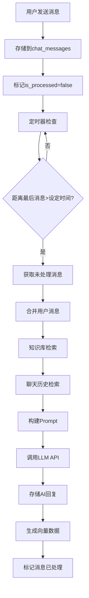

# 聊天机器人API架构设计

## 概述

聊天机器人系统架构支持：人设选择、Prompt构建、知识库检索、消息合并处理、定时话题推送等功能。

## 数据库架构

### 用户体系
```sql
-- 聊天用户表 (终端用户)
CREATE TABLE chat_users (
    id UUID PRIMARY KEY DEFAULT gen_random_uuid(),
    username VARCHAR(100) UNIQUE NOT NULL,      -- 用户名
    display_name VARCHAR(100),                  -- 显示名称
    avatar_url TEXT,                           -- 头像URL
    metadata JSONB,                            -- 用户其他信息
    created_at TIMESTAMPTZ DEFAULT NOW(),
    updated_at TIMESTAMPTZ DEFAULT NOW(),
    is_deleted BOOLEAN DEFAULT FALSE
);
```

### 聊天会话系统
```sql
-- 聊天会话表
CREATE TABLE chat_sessions (
    id UUID PRIMARY KEY DEFAULT gen_random_uuid(),
    user_id UUID REFERENCES chat_users(id),
    bot_personality_id UUID REFERENCES bot_personalities(id),
    session_name VARCHAR(200),
    
    -- 消息合并设置
    message_merge_seconds INTEGER DEFAULT 300,      -- 消息合并时间间隔(秒)
    
    -- 话题推送设置  
    topic_trigger_hours INTEGER DEFAULT 24,         -- 话题触发小时数
    is_topic_enabled BOOLEAN DEFAULT TRUE,          -- 是否启用话题推送
    
    last_message_at TIMESTAMPTZ,                   -- 最后消息时间
    last_processed_at TIMESTAMPTZ,                 -- 最后处理时间
    
    created_at TIMESTAMPTZ DEFAULT NOW(),
    updated_at TIMESTAMPTZ DEFAULT NOW(),
    is_deleted BOOLEAN DEFAULT FALSE
);

-- 聊天消息表 (明文存储)
CREATE TABLE chat_messages (
    id UUID PRIMARY KEY DEFAULT gen_random_uuid(),
    session_id UUID REFERENCES chat_sessions(id),
    user_id UUID REFERENCES chat_users(id),
    role VARCHAR(20) NOT NULL CHECK (role IN ('user', 'assistant', 'system', 'topic')),
    content TEXT NOT NULL,                      -- 明文消息内容
    metadata JSONB,                            -- 人设ID、prompt ID、知识库引用等
    is_processed BOOLEAN DEFAULT FALSE,         -- 是否已处理
    merge_group_id UUID,                       -- 消息合并组ID
    created_at TIMESTAMPTZ DEFAULT NOW()
);

-- 聊天向量表 (向量化存储)
CREATE TABLE chat_vectors (
    id UUID PRIMARY KEY DEFAULT gen_random_uuid(),
    session_id UUID REFERENCES chat_sessions(id),
    message_id UUID REFERENCES chat_messages(id) ON DELETE CASCADE,
    content TEXT NOT NULL,                      -- 用于向量化的文本
    embedding TEXT,                            -- 向量数据
    vector_type VARCHAR(50) DEFAULT 'message', -- message, summary, context
    created_at TIMESTAMPTZ DEFAULT NOW()
);
```

## API接口设计

### 1. 用户管理
```javascript
// 创建聊天用户
POST /api/chat/users
{
  "username": "user123",
  "display_name": "张三",
  "avatar_url": "https://...",
  "metadata": {}
}

// 获取用户信息
GET /api/chat/users/{id}
PUT /api/chat/users/{id}
```

### 2. 会话管理
```javascript
// 创建会话
POST /api/chat/sessions
{
  "user_id": "uuid",
  "bot_personality_id": "uuid", 
  "session_name": "与小助手的对话",
  "message_merge_seconds": 300,
  "topic_trigger_hours": 24
}

// 获取用户所有会话
GET /api/chat/sessions?user_id=uuid

// 更新会话设置
PUT /api/chat/sessions/{id}/settings
{
  "message_merge_seconds": 180,  // 3分钟合并
  "topic_trigger_hours": 12,     // 12小时推送话题
  "is_topic_enabled": true
}
```

### 3. 消息处理
```javascript
// 发送消息 (不立即处理)
POST /api/chat/message
{
  "session_id": "uuid",
  "content": "你好，今天天气怎么样？"
}

// 批量处理待处理消息
POST /api/chat/process-pending
{
  "session_id": "uuid"
}

// 获取会话历史
GET /api/chat/messages/{session_id}?limit=50&offset=0
```

### 4. 话题推送
```javascript
// 手动触发话题推送
POST /api/chat/topics/trigger
{
  "session_id": "uuid"
}

// 获取话题推送状态
GET /api/chat/topics/status?session_id=uuid
```

## 核心处理流程

### 消息处理流程


### LLM调用流程
```javascript
// /api/chat/process-pending 核心逻辑
async function processMessages(sessionId) {
  // 1. 获取会话信息和设置
  const session = await getSession(sessionId);
  const settings = session.settings;
  
  // 2. 获取未处理的用户消息
  const pendingMessages = await getPendingMessages(sessionId);
  
  // 3. 消息合并
  const mergedContent = pendingMessages
    .map(msg => msg.content)
    .join('\n\n');
  
  // 4. 知识库检索
  const knowledgeResults = await searchKnowledge(mergedContent);
  
  // 5. 聊天历史检索  
  const chatHistory = await getChatHistory(sessionId, limit: 10);
  
  // 6. 获取人设和Prompt
  const personality = await getBotPersonality(session.bot_personality_id);
  const promptTemplate = await getPromptTemplate(personality.prompt_id);
  
  // 7. 构建最终Prompt
  const finalPrompt = buildPrompt({
    personality,
    promptTemplate,
    knowledgeResults,
    chatHistory,
    userMessage: mergedContent
  });
  
  // 8. 调用云服务器LLM
  const aiResponse = await callLLMService(finalPrompt);
  
  // 9. 存储回复和向量化
  await saveAIResponse(sessionId, aiResponse);
  await vectorizeMessages(sessionId, [mergedContent, aiResponse]);
  
  // 10. 标记消息已处理
  await markMessagesProcessed(pendingMessages.map(m => m.id));
}
```

## 定时任务设计

### 消息处理定时器
```javascript
// 每30秒检查一次待处理消息
setInterval(async () => {
  const sessionsToProcess = await getSessionsNeedingProcessing();
  
  for (const session of sessionsToProcess) {
    const timeSinceLastMessage = Date.now() - session.last_message_at;
    const mergeThreshold = session.message_merge_seconds * 1000;
    
    if (timeSinceLastMessage >= mergeThreshold) {
      await processMessages(session.id);
    }
  }
}, 30000);
```

### 话题推送定时器
```javascript
// 每小时检查一次话题推送
setInterval(async () => {
  const sessionsForTopics = await getSessionsNeedingTopics();
  
  for (const session of sessionsForTopics) {
    const hoursSinceLastMessage = 
      (Date.now() - session.last_message_at) / (1000 * 60 * 60);
    
    if (hoursSinceLastMessage >= session.topic_trigger_hours) {
      await sendRandomTopic(session.id);
    }
  }
}, 3600000);
```

## 云服务器LLM集成

### LLM服务封装
```javascript
// /lib/llm-service.js
class LLMService {
  constructor(baseUrl, apiKey) {
    this.baseUrl = baseUrl;
    this.apiKey = apiKey;
  }
  
  async chat(prompt, options = {}) {
    const response = await fetch(`${this.baseUrl}/chat`, {
      method: 'POST',
      headers: {
        'Content-Type': 'application/json',
        'Authorization': `Bearer ${this.apiKey}`
      },
      body: JSON.stringify({
        prompt,
        max_tokens: options.maxTokens || 2000,
        temperature: options.temperature || 0.7,
        ...options
      })
    });
    
    if (!response.ok) {
      throw new Error(`LLM service error: ${response.statusText}`);
    }
    
    return await response.json();
  }
}

// 使用示例
const llmService = new LLMService(
  process.env.LLM_SERVICE_URL,
  process.env.LLM_SERVICE_API_KEY
);
```

## MVP实现优先级

### Phase 1: 基础功能
1. ✅ 创建数据库表结构
2. ✅ 用户和会话管理API
3. ✅ 基础消息发送/接收API
4. ✅ LLM服务集成

### Phase 2: 核心功能
1. ✅ 消息合并处理机制
2. ✅ 知识库检索集成
3. ✅ Prompt构建系统
4. ✅ 聊天历史检索

### Phase 3: 高级功能
1. ✅ 定时话题推送
2. ✅ 向量化存储优化
3. ✅ 性能监控和日志
4. ✅ 错误处理和重试机制

## 配置参数

### 环境变量
```bash
# LLM服务配置
LLM_SERVICE_URL=https://your-llm-server.com
LLM_SERVICE_API_KEY=your-api-key

# 消息处理配置
DEFAULT_MERGE_SECONDS=300
DEFAULT_TOPIC_HOURS=24
MESSAGE_PROCESSING_INTERVAL=30000

# 知识库配置
KNOWLEDGE_SEARCH_LIMIT=5
KNOWLEDGE_SIMILARITY_THRESHOLD=0.1
```

### 默认设置
```javascript
const DEFAULT_SETTINGS = {
  messageMergeSeconds: 300,      // 5分钟
  topicTriggerHours: 24,         // 24小时
  maxChatHistory: 10,            // 最多10条历史
  knowledgeSearchLimit: 5,       // 最多5条知识库结果
  llmMaxTokens: 2000,           // LLM最大Token数
  llmTemperature: 0.7           // LLM温度参数
};
``` 