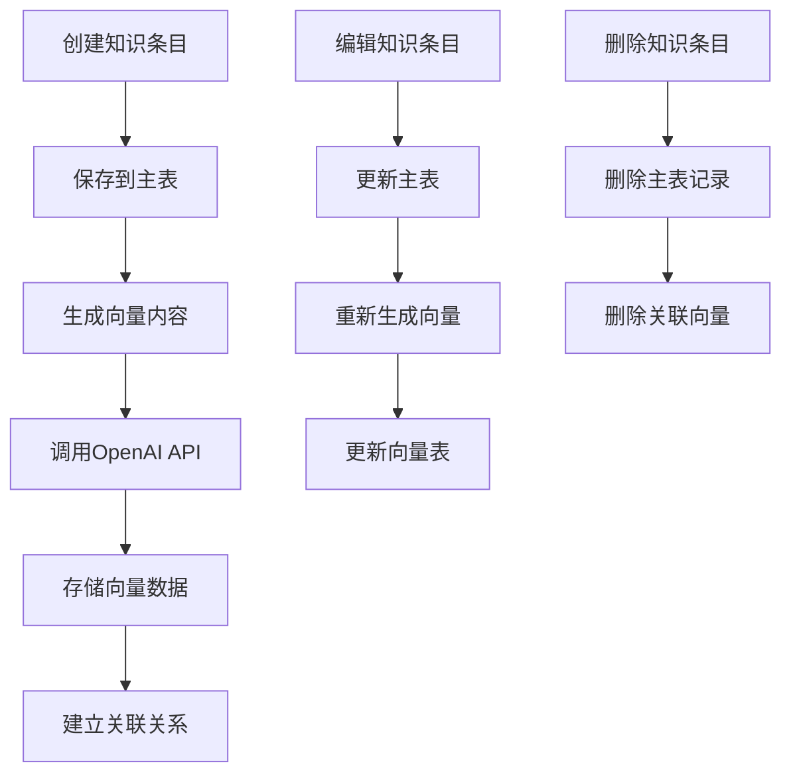
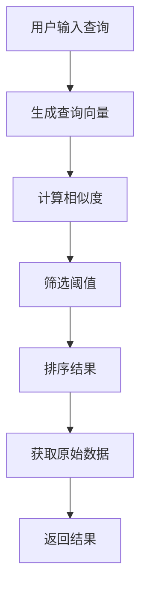

# 知识库管理功能规则文档

## 概述

知识库管理系统集成缩写库、话术库和AI向量搜索功能，支持智能检索和自动向量化，为聊天机器人提供知识支持。

## 功能设计思路

### 核心理念
- **双模式存储**: 结构化数据 + 向量化搜索
- **AI驱动**: OpenAI Embedding自动生成向量
- **智能检索**: 语义相似度搜索
- **实时同步**: 数据变更时自动更新向量

### 业务场景
1. **缩写库**: 越南语地址缩写、常用词汇缩写
2. **话术库**: 不同场景下的对话模板和回答话术
3. **智能搜索**: 根据查询内容找到相关知识

## 技术架构

### 数据库设计

#### 核心表结构
```sql
-- 缩写库表
CREATE TABLE knowledge_abbreviations (
    id UUID PRIMARY KEY,
    category VARCHAR(100) NOT NULL,      -- 分类
    abbreviation VARCHAR(50) NOT NULL,   -- 缩写
    full_form VARCHAR(200) NOT NULL,     -- 完整形式
    description TEXT,                    -- 描述
    created_at TIMESTAMPTZ DEFAULT NOW(),
    updated_at TIMESTAMPTZ DEFAULT NOW()
);

-- 话术库表  
CREATE TABLE knowledge_scripts (
    id UUID PRIMARY KEY,
    scenario VARCHAR(100) NOT NULL,      -- 场景
    text TEXT NOT NULL,                  -- 用户对话
    answer TEXT NOT NULL,                -- 回答话术
    created_at TIMESTAMPTZ DEFAULT NOW(),
    updated_at TIMESTAMPTZ DEFAULT NOW()
);

-- 向量表
CREATE TABLE knowledge_vectors (
    id UUID PRIMARY KEY,
    document_id UUID NOT NULL,           -- 关联文档ID
    document_type VARCHAR(20) NOT NULL,  -- 'abbreviation' 或 'script'
    content TEXT NOT NULL,               -- 索引内容
    embedding vector(1536),              -- OpenAI embedding向量
    metadata JSONB,                      -- 元数据
    created_at TIMESTAMPTZ DEFAULT NOW(),
    updated_at TIMESTAMPTZ DEFAULT NOW()
);
```

#### 向量搜索函数
```sql
CREATE OR REPLACE FUNCTION match_documents(
    query_embedding vector(1536),
    match_count int DEFAULT 5,
    similarity_threshold float DEFAULT 0.5,
    doc_type text DEFAULT NULL
) RETURNS TABLE (
    id uuid,
    document_id uuid,
    document_type varchar(20),
    content text,
    metadata jsonb,
    similarity float
)
```

### AI集成设计

#### OpenAI Embedding
- **模型**: text-embedding-3-small (1536维度)
- **内容处理**: 文本预处理和向量化
- **存储格式**: JSON字符串存储，兼容pgvector

#### 向量化策略
```typescript
// 缩写库向量化内容
const vectorContent = `${abbreviation} - ${full_form} - ${description || ''}`

// 话术库向量化内容  
const vectorContent = `用户: ${text} | 回答: ${answer}`
```

### API设计

#### 向量化API (`/api/vectorize`)
```typescript
// POST - 创建/更新向量
{
  documentId: string,
  content: string,
  metadata: {
    type: 'abbreviation' | 'script',
    category?: string,
    scenario?: string
  }
}

// DELETE - 删除向量
?documentId={id}&documentType={type}
```

#### 搜索API (`/api/search`)
```typescript
// POST - 语义搜索
{
  query: string,
  limit?: number,
  similarity_threshold?: number
}

// 返回结果
{
  results: [{
    id: string,
    title: string, 
    content: string,
    type: string,
    similarity: number,
    metadata: object
  }]
}
```

### 前端实现

#### 知识库管理页面
- **双标签页**: 缩写库 / 话术库切换
- **分类筛选**: 动态分类管理和筛选
- **搜索功能**: 实时搜索和高亮显示
- **CRUD操作**: 创建、编辑、删除知识条目

#### 向量测试组件
- **检索测试**: 实时测试向量搜索效果
- **相似度调节**: 动态调整相似度阈值
- **调试信息**: 显示向量维度、检索统计
- **结果展示**: 相似度排序的搜索结果

## 数据流程

### 知识条目生命周期


### 搜索流程


## 特性实现

### 动态分类管理
- **自动发现**: 从数据中提取分类
- **排序规则**: 按字母排序，"其他"分类置底
- **新增分类**: 支持在创建时添加新分类
- **分类编辑**: 批量更新分类名称

### 向量搜索优化
- **索引策略**: IVFFlat索引优化查询性能
- **相似度算法**: 余弦相似度计算
- **阈值控制**: 用户可调节相似度阈值
- **结果限制**: 可配置返回结果数量

### 错误处理
- **向量化失败**: 仍保存文本内容，便于后续处理
- **API错误**: graceful degradation，不影响主要功能
- **数据一致性**: 确保主表和向量表的数据同步

## 性能优化

### 数据库优化
```sql
-- 向量搜索索引
CREATE INDEX knowledge_vectors_embedding_idx 
ON knowledge_vectors USING ivfflat (embedding vector_cosine_ops)
WITH (lists = 100);

-- 文档关联索引
CREATE INDEX knowledge_vectors_document_idx 
ON knowledge_vectors (document_id, document_type);

-- 分类搜索索引
CREATE INDEX knowledge_abbreviations_category_idx 
ON knowledge_abbreviations (category);
```

### 前端优化
- **防抖搜索**: 300ms防抖避免频繁API调用
- **局部更新**: 增删改时局部更新状态，避免重新获取全量数据
- **虚拟化**: 大量数据时支持虚拟滚动
- **缓存机制**: 搜索结果客户端缓存

## 扩展性设计

### 支持更多知识类型
```typescript
// 可扩展的文档类型
type DocumentType = 'abbreviation' | 'script' | 'document' | 'faq' | 'product'
```

### 多语言支持
- **内容字段**: 支持多语言版本
- **向量化**: 不同语言分别向量化
- **搜索**: 语言特定的搜索结果

### 高级搜索功能
- **混合搜索**: 结合全文检索和向量搜索
- **多模态**: 支持图片、文档等多种格式
- **个性化**: 基于用户行为的搜索优化

## 监控和分析

### 搜索分析
- **热门查询**: 统计最常搜索的内容
- **搜索效果**: 分析搜索结果的点击率
- **性能监控**: API响应时间和成功率

### 知识库质量
- **覆盖率**: 搜索命中率分析
- **重复检测**: 发现重复或相似内容
- **质量评分**: 基于使用频率的内容评分

## 测试策略

### 单元测试
- [ ] 向量化API测试
- [ ] 搜索API测试  
- [ ] 相似度计算测试
- [ ] 数据CRUD测试

### 集成测试
- [ ] OpenAI API集成测试
- [ ] 数据库向量扩展测试
- [ ] 端到端搜索流程测试

### 性能测试
- [ ] 大量数据下的搜索性能
- [ ] 并发搜索压力测试
- [ ] 向量化批处理性能

## 相关文件

### 数据库
- `database/knowledge_base_schema.sql` - 知识库表结构和函数

### 前端
- `src/app/knowledge/page.tsx` - 知识库管理主页面
- `src/app/knowledge/test-vector.tsx` - 向量测试组件

### API
- `src/app/api/search/route.ts` - 搜索API
- `src/app/api/vectorize/route.ts` - 向量化API
- `src/lib/vector.ts` - 向量操作工具函数

### 工具
- `src/lib/supabase.ts` - 数据库连接配置

## 部署要求

### 数据库扩展
```sql
-- 启用pgvector扩展
CREATE EXTENSION IF NOT EXISTS vector;
```

### 环境变量
```bash
# OpenAI API配置
OPENAI_API_KEY=your_openai_api_key

# Supabase配置  
NEXT_PUBLIC_SUPABASE_URL=your_supabase_url
NEXT_PUBLIC_SUPABASE_ANON_KEY=your_supabase_anon_key
```

### 依赖包
```json
{
  "openai": "^4.x.x",
  "@supabase/supabase-js": "^2.x.x"
}
```

## 技术债务和修复记录

### 时间戳问题修复（2024年修复）

**问题描述**：
在知识库更新内容时，knowledge数据库和向量化数据库中的`created_at`和`updated_at`都会被更新，违背了时间戳的语义。

**问题根源**：
1. 更新知识库内容时，触发器会删除旧的向量记录并重新插入新的向量记录
2. 新插入的向量记录会自动设置`created_at = NOW()`
3. 这导致原始创建时间丢失

**解决方案**：
1. 创建了带时间戳参数的向量生成函数：
   - `create_abbreviation_vectors_with_timestamp()`
   - `create_script_vectors_with_timestamp()`

2. 修改了自动向量化触发器：
   - 在删除前获取原始的`created_at`时间戳
   - 在重新插入时保留原始的`created_at`
   - 确保只有`updated_at`被更新为当前时间

3. 保持向后兼容性：
   - 原有函数仍然可用，内部调用新的带时间戳版本
   - 现有代码无需修改

**修复后的行为**：
- **创建**：`created_at`和`updated_at`都设置为当前时间
- **更新**：`created_at`保持不变，`updated_at`更新为当前时间

**相关文件**：
- `database/knowledge_base_schema.sql` - 数据库函数和触发器修复
- 触发器函数：`auto_vectorize_abbreviation()`, `auto_vectorize_script()`
- 向量生成函数：`create_*_vectors_with_timestamp()` 