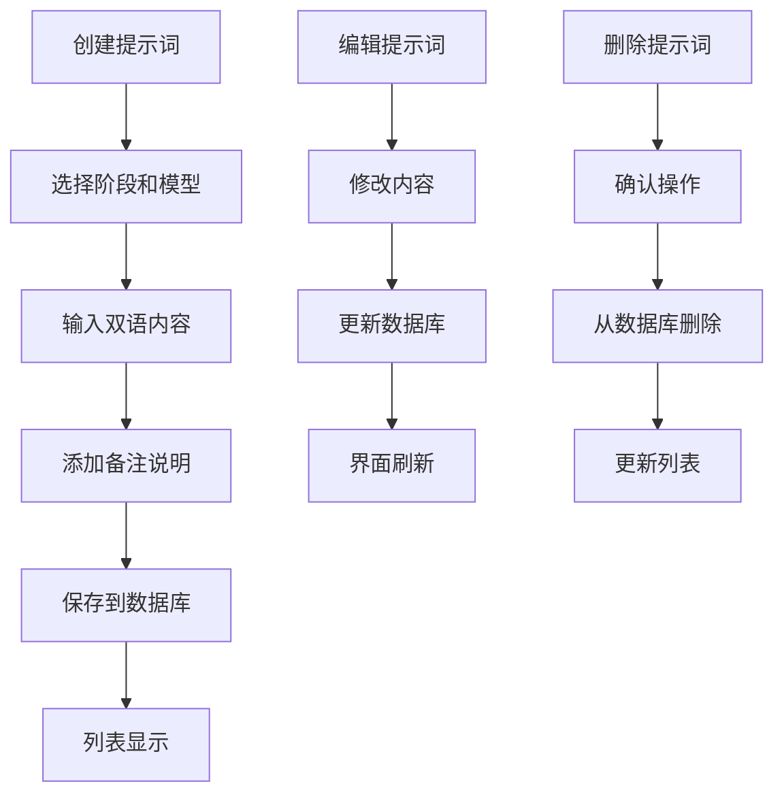
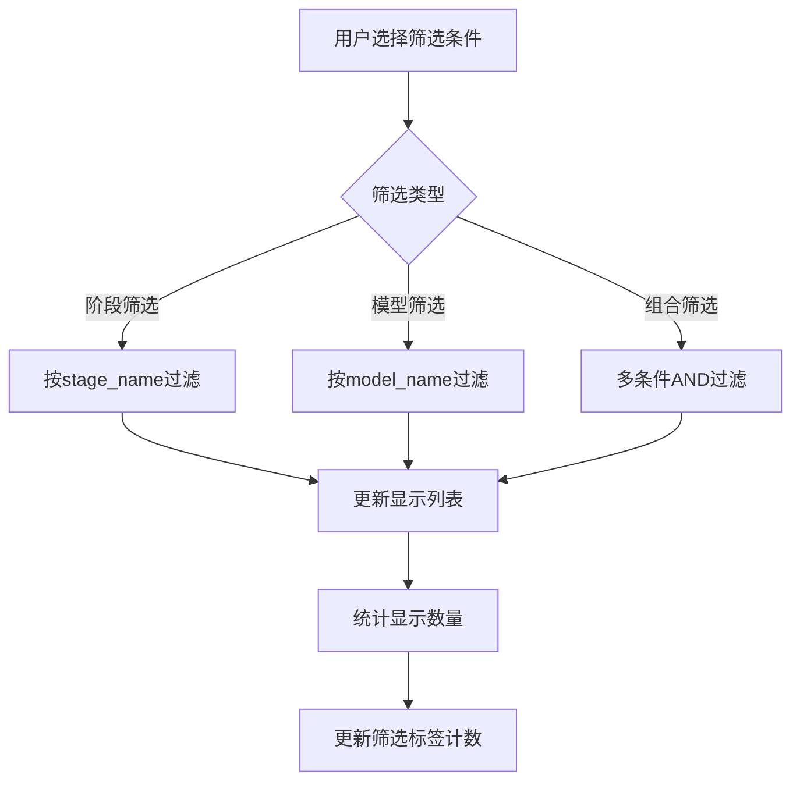

# 提示词管理功能规则文档

## 概述

提示词管理系统为AI聊天机器人提供多阶段、多模型的对话提示词模板管理，支持中文/越南语双语提示词，实现精准的对话场景控制。

## 功能设计思路

### 核心理念
- **阶段化管理**: 按对话发展阶段组织提示词
- **模型适配**: 支持不同AI模型的提示词优化
- **双语支持**: 中文/越南语并行管理，适应多语言对话
- **灵活配置**: 可视化管理，支持实时预览和调试

### 业务场景
1. **聊天引导**: 不同阶段的对话策略和风格控制
2. **多模型支持**: 针对不同AI模型优化提示词
3. **国际化**: 支持多语言对话场景
4. **A/B测试**: 比较不同提示词的效果

## 技术架构

### 数据库设计

#### 提示词表结构
```sql
CREATE TABLE prompts (
    id UUID DEFAULT gen_random_uuid() PRIMARY KEY,
    name VARCHAR(255) NOT NULL,               -- 提示词名称
    stage_name VARCHAR(100) NOT NULL,         -- 聊天阶段
    model_name VARCHAR(100) NOT NULL,         -- AI模型名称
    prompt_cn TEXT NOT NULL,                  -- 中文提示词
    prompt_vn TEXT NOT NULL,                  -- 越南语提示词
    mark TEXT,                                -- 备注说明
    created_at TIMESTAMPTZ DEFAULT NOW(),
    updated_at TIMESTAMPTZ DEFAULT NOW()
);
```

### 阶段化设计

#### 对话阶段定义
```typescript
const stageOptions = [
  { value: 'first_meet', label: '初识', color: 'purple' },
  { value: 'learn_hobbies', label: '了解爱好', color: 'orange' },
  { value: 'build_intimacy', label: '加深感情', color: 'cyan' },
  { value: 'romance', label: '恋爱', color: 'pink' }
]
```

#### 阶段特性
- **初识阶段**: 礼貌介绍，建立第一印象
- **了解爱好**: 深入了解对方兴趣爱好
- **加深感情**: 增进情感交流和理解
- **恋爱模式**: 浪漫化的对话风格

### 模型适配

#### 支持的AI模型
```typescript
const modelOptions = [
  { value: 'qwen3-32B', label: 'qwen3-32B' },
  { value: 'gemma3-27B', label: 'gemma3-27B' }
]
```

#### 模型特性考虑
- **响应风格**: 不同模型的语言风格差异
- **参数调优**: 针对模型特性的提示词优化
- **性能表现**: 考虑模型的推理能力和响应速度

## 前端实现

### 视觉设计系统

#### 颜色配置
```typescript
type ColorConfig = {
  purple: { light: {...}, dark: {...}, active: {...} },
  orange: { light: {...}, dark: {...}, active: {...} },
  cyan: { light: {...}, dark: {...}, active: {...} },
  pink: { light: {...}, dark: {...}, active: {...} }
}
```

#### 阶段色彩编码
- **初识**: 紫色 - 神秘而优雅
- **了解爱好**: 橙色 - 温暖而活跃
- **加深感情**: 青色 - 清新而深入
- **恋爱**: 粉色 - 浪漫而温馨

### 交互设计

#### 筛选系统
```typescript
// 双重筛选：阶段 + 模型
const filteredPrompts = prompts.filter(prompt => {
  const stageMatch = selectedStage === 'all' || prompt.stage_name === selectedStage
  const modelMatch = selectedModel === 'all' || prompt.model_name === selectedModel
  return stageMatch && modelMatch
})
```

#### 内容展示组件
- **展开/收起**: 长文本内容智能展开控制
- **双语显示**: 中文和越南语内容并排显示
- **备注系统**: 支持详细的使用说明和备注

### 提示词内容组件

#### 智能展开功能
```typescript
function PromptContent({ content, stageColor = 'gray' }) {
  const [isExpanded, setIsExpanded] = useState(false)
  const [shouldShowButton, setShouldShowButton] = useState(false)
  
  // 检查内容高度是否超过阈值
  const checkHeight = useCallback(() => {
    if (contentRef.current) {
      const lineHeight = parseInt(window.getComputedStyle(contentRef.current).lineHeight)
      const defaultMaxHeight = lineHeight * 5 // 5行的高度
      const scrollHeight = contentRef.current.scrollHeight
      setShouldShowButton(scrollHeight > defaultMaxHeight)
      setMaxHeight(isExpanded ? `${scrollHeight}px` : `${defaultMaxHeight}px`)
    }
  }, [isExpanded])
}
```

#### 渐变遮罩效果
- **浅色模式**: 根据阶段颜色生成对应渐变
- **深色模式**: 统一使用背景色渐变，确保文字逐渐消失效果
- **动态调整**: 根据内容长度自动显示/隐藏展开按钮

## 数据流程

### 提示词生命周期


### 筛选查询流程


## 特性实现

### 自动命名系统
```sql
-- 自动为现有记录生成默认名称
UPDATE prompts 
SET name = CONCAT(
  CASE 
    WHEN stage_name = 'first_meet' THEN '初次见面'
    WHEN stage_name = 'learn_hobbies' THEN '了解爱好'
    WHEN stage_name = 'build_intimacy' THEN '加深感情'
    WHEN stage_name = 'romance' THEN '恋爱模式'
    ELSE stage_name
  END,
  ' - ',
  model_name
)
WHERE name = '' OR name IS NULL;
```

### 筛选标签系统
```typescript
// 阶段筛选选项
const stageFilterOptions = [
  { value: 'all', label: '全部', count: prompts.length },
  ...stageOptions.map(stage => ({
    value: stage.value,
    label: stage.label,
    count: prompts.filter(p => p.stage_name === stage.value).length,
    color: stage.color
  }))
]

// 模型筛选选项
const modelFilterOptions = [
  { value: 'all', label: '全部', count: prompts.length },
  ...['qwen3-32B', 'gemma3-27B'].map(model => ({
    value: model,
    label: model,
    count: prompts.filter(p => p.model_name === model).length,
    color: 'indigo',
    icon: <Bot className="w-3 h-3" />
  }))
]
```

### 响应式设计
- **卡片布局**: 提示词以卡片形式展示
- **悬停效果**: 鼠标悬停显示操作按钮
- **移动适配**: 支持移动设备的触摸操作
- **深色模式**: 完整的深色主题支持

## 性能优化

### 数据库优化
```sql
-- 阶段索引
CREATE INDEX IF NOT EXISTS idx_prompts_stage_name ON prompts(stage_name);

-- 模型索引  
CREATE INDEX IF NOT EXISTS idx_prompts_model_name ON prompts(model_name);

-- 名称索引
CREATE INDEX IF NOT EXISTS idx_prompts_name ON prompts(name);

-- 复合索引：阶段+模型
CREATE INDEX IF NOT EXISTS idx_prompts_stage_model 
ON prompts(stage_name, model_name);
```

### 前端优化
- **状态管理**: 合理使用useState和useEffect
- **防抖处理**: 搜索和筛选操作防抖
- **组件记忆**: 使用React.memo优化渲染
- **懒加载**: 大量内容的按需加载

## 扩展性设计

### 多语言扩展
```typescript
interface MultiLanguagePrompt {
  id: string
  name: string
  stage_name: string
  model_name: string
  prompts: {
    cn: string      // 中文
    vn: string      // 越南语
    en?: string     // 英语
    th?: string     // 泰语
    ko?: string     // 韩语
  }
  mark?: string
}
```

### 版本控制
- **历史记录**: 保存提示词的修改历史
- **版本对比**: 比较不同版本的差异
- **回滚功能**: 支持回滚到历史版本
- **变更追踪**: 记录修改者和修改时间

### A/B测试支持
- **测试组配置**: 为同一场景配置多个提示词版本
- **效果统计**: 收集不同提示词的使用效果
- **智能推荐**: 基于效果数据推荐最优提示词

## 最佳实践

### 提示词编写规范
1. **明确目标**: 清晰定义对话目标和期望结果
2. **语言风格**: 保持与阶段特征一致的语言风格
3. **文化适应**: 考虑不同语言的文化差异
4. **长度控制**: 避免过长或过短的提示词
5. **测试验证**: 实际测试提示词的效果

### 管理建议
- **定期审查**: 定期审查和更新提示词内容
- **用户反馈**: 收集用户对对话质量的反馈
- **数据分析**: 分析对话数据优化提示词
- **团队协作**: 建立提示词管理的团队协作流程

## 测试策略

### 功能测试
- [ ] 提示词CRUD操作
- [ ] 筛选功能正确性
- [ ] 双语内容管理
- [ ] 阶段色彩显示
- [ ] 展开/收起功能

### 内容测试
- [ ] 提示词效果验证
- [ ] 不同模型适配测试
- [ ] 多语言内容一致性
- [ ] 阶段过渡自然性

### 性能测试
- [ ] 大量提示词加载性能
- [ ] 筛选响应速度
- [ ] 内容展开动画流畅性

## 相关文件

### 数据库
- `database/prompts_management_schema.sql` - 提示词表结构

### 前端
- `src/app/prompts/page.tsx` - 提示词管理主页面

### 组件
- `src/components/ui/filter-tabs.tsx` - 筛选标签组件
- `src/components/ui/modal.tsx` - 模态框组件
- `src/components/ui/form.tsx` - 表单组件

### 样式
- `src/app/globals.css` - 全局样式和主题变量

### 工具
- `src/lib/supabase.ts` - 数据库操作
- `src/hooks/useAuth.ts` - 权限验证

## 部署配置

### 数据库初始化
```sql
-- 添加name字段（如果升级现有系统）
ALTER TABLE prompts ADD COLUMN IF NOT EXISTS name VARCHAR(255) NOT NULL DEFAULT '';

-- 移除默认值约束
ALTER TABLE prompts ALTER COLUMN name DROP DEFAULT;
```

### 环境变量
无需额外环境变量，使用现有的Supabase配置即可。 