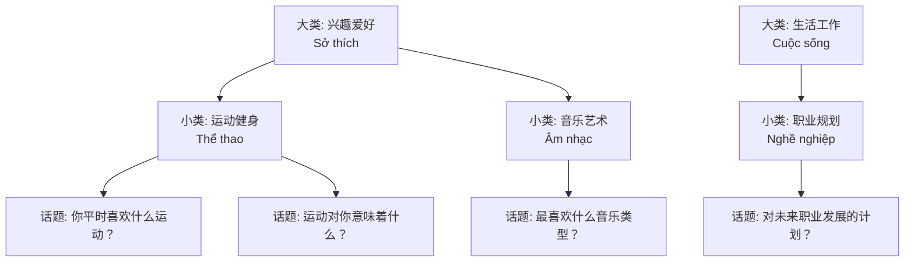
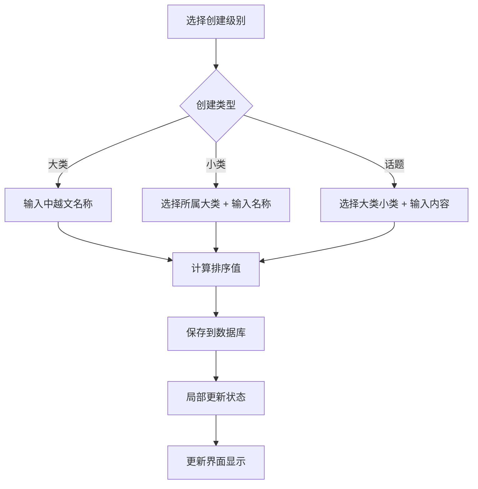
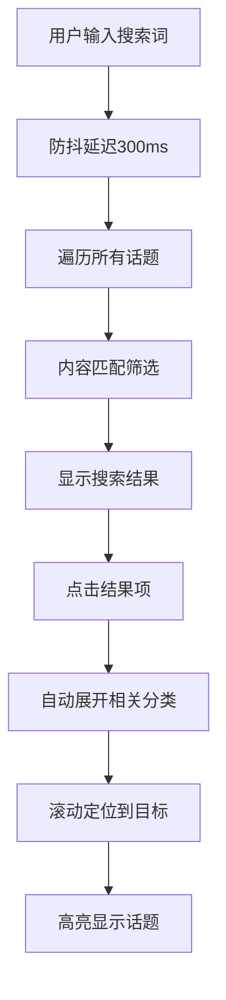

# 话题管理功能规则文档

## 概述

话题管理系统提供三级分类的对话话题组织结构，支持中文/越南语双语管理，为聊天机器人提供丰富的对话主题内容。

## 功能设计思路

### 核心理念
- **层级管理**: 大类→小类→具体话题的三级分类结构
- **双语支持**: 中文/越南语并行管理，适应多语言场景
- **灵活排序**: 自定义排序，支持优先级调整
- **使用统计**: 记录话题使用频率，优化内容质量

### 业务场景
1. **对话引导**: 为聊天机器人提供话题建议
2. **内容分类**: 有序组织对话主题
3. **多语言**: 支持中越双语环境
4. **数据分析**: 统计话题受欢迎程度

## 技术架构

### 数据库设计

#### 三级表结构
```sql
-- 话题大类表
CREATE TABLE topic_categories (
    id UUID DEFAULT gen_random_uuid() PRIMARY KEY,
    name_cn VARCHAR(255) NOT NULL,        -- 中文名称
    name_vn VARCHAR(255) NOT NULL,        -- 越南语名称
    sort_order INTEGER DEFAULT 1000,      -- 排序值
    created_at TIMESTAMP WITH TIME ZONE DEFAULT NOW(),
    updated_at TIMESTAMP WITH TIME ZONE DEFAULT NOW()
);

-- 话题小类表
CREATE TABLE topic_subcategories (
    id UUID DEFAULT gen_random_uuid() PRIMARY KEY,
    category_id UUID NOT NULL REFERENCES topic_categories(id) ON DELETE CASCADE,
    name_cn VARCHAR(255) NOT NULL,
    name_vn VARCHAR(255) NOT NULL,
    sort_order INTEGER DEFAULT 1000,
    created_at TIMESTAMP WITH TIME ZONE DEFAULT NOW(),
    updated_at TIMESTAMP WITH TIME ZONE DEFAULT NOW()
);

-- 话题表
CREATE TABLE topics (
    id UUID DEFAULT gen_random_uuid() PRIMARY KEY,
    category_id UUID NOT NULL REFERENCES topic_categories(id) ON DELETE CASCADE,
    subcategory_id UUID NOT NULL REFERENCES topic_subcategories(id) ON DELETE CASCADE,
    content TEXT NOT NULL,                 -- 话题内容
    usage_count INTEGER DEFAULT 0,         -- 使用次数
    sort_order INTEGER DEFAULT 1000,
    created_at TIMESTAMP WITH TIME ZONE DEFAULT NOW(),
    updated_at TIMESTAMP WITH TIME ZONE DEFAULT NOW()
);
```

#### 关系设计
- **级联删除**: 删除大类时自动删除关联的小类和话题
- **外键约束**: 确保数据引用完整性
- **索引优化**: 分类ID和排序字段建立索引

### 排序策略

#### 排序值设计
- **起始值**: 从1000开始，便于在前面插入高优先级内容
- **间隔值**: 建议使用10的倍数，便于中间插入
- **自动分配**: 新建时自动分配下一个可用值

#### 排序逻辑
```typescript
// 获取下一个排序值
const maxSortOrder = items.length > 0 
  ? Math.max(...items.map(item => item.sort_order)) 
  : 999
const nextSortOrder = maxSortOrder + 1
```

### 前端实现

#### 树形展示结构


#### 交互设计
- **展开/收起**: 点击大类和小类可展开下级内容
- **拖拽防护**: 防止意外拖拽影响展开/收起
- **搜索定位**: 搜索结果可自动展开并定位到目标话题
- **添加按钮**: 每级分类下方提供快速添加按钮

## 特性实现

### 搜索功能
```typescript
// 防抖搜索实现
useEffect(() => {
  const timer = setTimeout(() => {
    setDebouncedSearchTerm(searchTerm)
  }, 300) // 300ms防抖
  return () => clearTimeout(timer)
}, [searchTerm])

// 搜索结果处理
const searchResults = categories.flatMap(category => 
  category.subcategories.flatMap(subcategory => 
    subcategory.topics.filter(topic => 
      topic.content.toLowerCase().includes(searchTerm.toLowerCase())
    )
  )
)
```

### 智能展开
- **搜索定位**: 搜索到话题时自动展开相关分类
- **状态管理**: 使用Set管理展开状态，性能优化
- **高亮显示**: 搜索结果高亮显示，便于识别

### 数据优化
- **局部更新**: CRUD操作时避免重新获取全量数据
- **性能统计**: useMemo优化分类统计计算
- **JOIN查询**: 使用单次JOIN查询获取完整数据结构

## 数据流程

### 创建流程


### 搜索流程


## 用户体验设计

### 交互优化
- **点击区域**: 明确区分展开和编辑操作区域
- **鼠标悬停**: 悬停显示操作按钮，避免界面拥挤
- **文字选择**: 支持分类名称和话题内容的文字选择
- **拖拽保护**: 防止文字选择误触发展开/收起

### 视觉设计
- **图标区分**: 不同级别使用不同图标标识
  - 大类: Hash图标 (#)
  - 小类: Folder图标
  - 话题: MessageSquare图标
- **颜色编码**: 悬停和操作按钮使用色彩区分功能
- **层级缩进**: 清晰的视觉层级关系

### 响应式设计
- **移动适配**: 支持移动设备的触摸操作
- **文字折行**: 长内容自动换行显示
- **弹性布局**: 适应不同屏幕尺寸

## 性能优化

### 数据库优化
```sql
-- 分类排序索引
CREATE INDEX idx_topic_categories_sort_order ON topic_categories(sort_order);

-- 小类关联和排序索引
CREATE INDEX idx_topic_subcategories_sort_order 
ON topic_subcategories(category_id, sort_order);

-- 话题关联和排序索引
CREATE INDEX idx_topics_sort_order 
ON topics(subcategory_id, sort_order);

-- 使用统计索引
CREATE INDEX idx_topics_usage_count ON topics(usage_count DESC);
```

### 前端优化
```typescript
// 使用useMemo优化统计计算
const categoryStats = useMemo(() => {
  return categories.map(category => ({
    id: category.id,
    subcategoryCount: category.subcategories.length,
    topicCount: category.subcategories.reduce((sum, sub) => sum + sub.topics.length, 0)
  }))
}, [categories])

// 使用useCallback优化事件处理
const toggleCategory = useCallback((categoryId: string) => {
  setExpandedCategories(prev => {
    const newExpanded = new Set(prev)
    if (newExpanded.has(categoryId)) {
      newExpanded.delete(categoryId)
    } else {
      newExpanded.add(categoryId)
    }
    return newExpanded
  })
}, [])
```

## 示例数据

### 初始化数据结构
```sql
-- 大类示例
INSERT INTO topic_categories (name_cn, name_vn, sort_order) VALUES 
('兴趣爱好', 'Sở thích', 1000),
('生活工作', 'Cuộc sống và công việc', 1001),
('情感关系', 'Tình cảm và mối quan hệ', 1002);

-- 小类示例
INSERT INTO topic_subcategories (category_id, name_cn, name_vn, sort_order) VALUES 
('运动健身', 'Thể thao và sức khỏe', 1000),
('音乐艺术', 'Âm nhạc và nghệ thuật', 1001),
('职业规划', 'Quy hoạch nghề nghiệp', 1000),
('日常生活', 'Cuộc sống hàng ngày', 1001);

-- 话题示例
INSERT INTO topics (category_id, subcategory_id, content, sort_order) VALUES 
('你平时喜欢做什么运动？为什么选择这项运动？', 1000),
('你最喜欢什么类型的音乐？有没有特别喜欢的歌手或乐队？', 1000),
('你对自己未来的职业发展有什么计划？', 1000),
('你觉得真正的友谊应该是什么样的？', 1000);
```

## 扩展性考虑

### 多语言扩展
```typescript
// 支持更多语言的数据结构
interface MultiLanguageTopic {
  id: string
  names: {
    cn: string    // 中文
    vn: string    // 越南语
    en?: string   // 英语
    th?: string   // 泰语
  }
  content: {
    cn: string
    vn: string
    en?: string
    th?: string
  }
}
```

### 标签系统
- **话题标签**: 为话题添加标签分类
- **难度等级**: 标记话题的复杂程度
- **适用场景**: 标记适用的聊天场景

### 统计分析
- **使用热度**: 统计话题的使用频率
- **用户反馈**: 收集话题的质量评分
- **效果分析**: 分析话题的对话效果

## 测试策略

### 功能测试
- [ ] 三级分类CRUD操作
- [ ] 排序功能正确性
- [ ] 级联删除功能
- [ ] 搜索和定位功能
- [ ] 双语内容管理

### 性能测试
- [ ] 大量数据下的展示性能
- [ ] 搜索响应时间
- [ ] 数据库查询效率

### 用户体验测试
- [ ] 展开/收起交互体验
- [ ] 移动端适配效果
- [ ] 文字选择和拖拽防护

## 相关文件

### 数据库
- `database/topics_management_schema.sql` - 话题管理表结构

### 前端
- `src/app/topics/page.tsx` - 话题管理主页面

### 组件
- `src/components/ui/search-box.tsx` - 搜索组件
- `src/components/ui/modal.tsx` - 模态框组件
- `src/components/ui/form.tsx` - 表单组件

### 工具
- `src/lib/supabase.ts` - 数据库操作
- `src/hooks/useAuth.ts` - 权限验证 