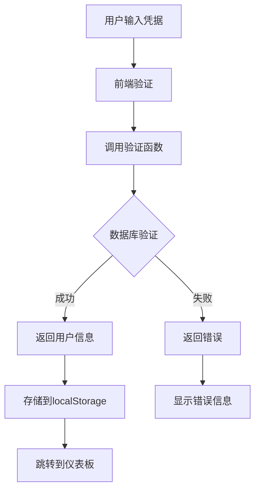
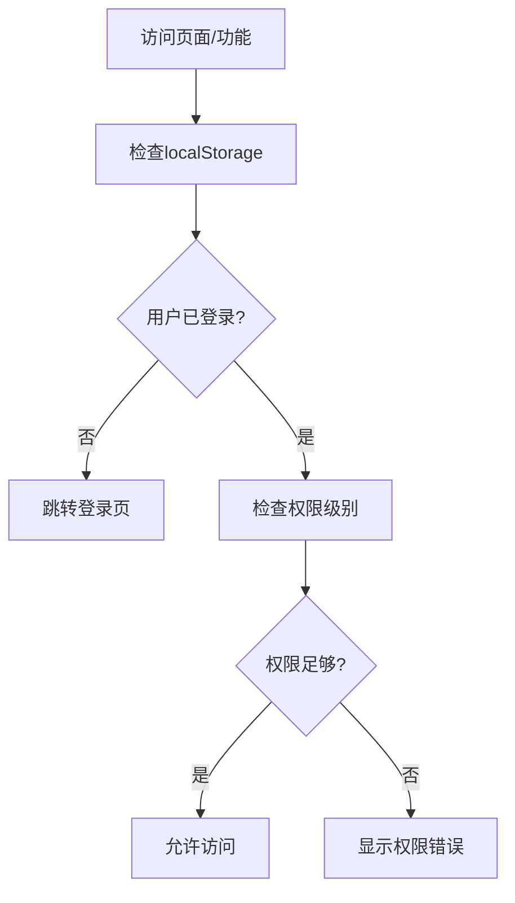

# 用户认证功能规则文档

## 概述

用户认证系统提供基于角色的权限控制，支持四级权限管理，确保系统安全性和功能访问控制。

## 功能设计思路

### 核心理念
- **安全优先**: 使用bcrypt加密，安全存储密码
- **角色分离**: 四级权限体系，细粒度访问控制
- **会话管理**: 基于localStorage的客户端会话管理
- **权限验证**: 页面级权限检查，防止越权访问

### 权限体系设计
```
super_admin (超级管理员) - 完全访问权限
    └── admin (管理员) - 管理所有业务功能
        └── operator (操作员) - 管理知识库和话题
            └── viewer (查看者) - 仅查看用户信息
```

## 技术实现

### 数据库设计

#### 用户表结构
```sql
CREATE TABLE users (
    user_id UUID PRIMARY KEY DEFAULT uuid_generate_v4(),
    username VARCHAR(100) UNIQUE NOT NULL,
    password_hash TEXT NOT NULL,  -- bcrypt加密
    role VARCHAR(20) NOT NULL CHECK (role IN ('super_admin', 'admin', 'operator', 'viewer')),
    email VARCHAR(255),
    created_at TIMESTAMPTZ DEFAULT NOW(),
    updated_at TIMESTAMPTZ DEFAULT NOW()
);
```

#### 密码验证函数
```sql
CREATE OR REPLACE FUNCTION verify_user_password(input_username TEXT, input_password TEXT)
RETURNS TABLE(user_id UUID, username TEXT, role TEXT, success BOOLEAN) AS $$
DECLARE
    user_record RECORD;
    password_match BOOLEAN;
BEGIN
    SELECT u.user_id, u.username, u.password_hash, u.role
    INTO user_record
    FROM users u
    WHERE u.username = input_username;
    
    IF user_record.user_id IS NULL THEN
        RETURN QUERY SELECT NULL::UUID, ''::TEXT, ''::TEXT, FALSE;
        RETURN;
    END IF;
    
    SELECT (u.password_hash = crypt(input_password, u.password_hash))
    INTO password_match
    FROM users u
    WHERE u.user_id = user_record.user_id;
    
    IF password_match THEN
        RETURN QUERY SELECT user_record.user_id, user_record.username, user_record.role, TRUE;
    ELSE
        RETURN QUERY SELECT NULL::UUID, ''::TEXT, ''::TEXT, FALSE;
    END IF;
END;
$$ LANGUAGE plpgsql;
```

### 前端认证流程

#### 登录组件设计
```typescript
// 登录表单状态管理
const [credentials, setCredentials] = useState({
  username: '',
  password: ''
})
const [isLoading, setIsLoading] = useState(false)
const [error, setError] = useState('')

// 登录验证流程
const handleLogin = async (e: React.FormEvent) => {
  e.preventDefault()
  setIsLoading(true)
  setError('')
  
  try {
    const { data, error } = await supabase
      .rpc('verify_user_password', {
        input_username: credentials.username,
        input_password: credentials.password
      })
    
    if (error || !data?.[0]?.success) {
      throw new Error('用户名或密码错误')
    }
    
    const userData = data[0]
    localStorage.setItem('user', JSON.stringify(userData))
    router.push('/dashboard')
  } catch (err) {
    setError(err.message)
  } finally {
    setIsLoading(false)
  }
}
```

#### 权限检查Hook
```typescript
function useAuth() {
  const [user, setUser] = useState(null)
  const [isLoading, setIsLoading] = useState(true)
  
  useEffect(() => {
    const storedUser = localStorage.getItem('user')
    if (storedUser) {
      setUser(JSON.parse(storedUser))
    }
    setIsLoading(false)
  }, [])
  
  const logout = () => {
    localStorage.removeItem('user')
    setUser(null)
    window.location.href = '/'
  }
  
  const hasPermission = (requiredRole: string) => {
    if (!user) return false
    
    const roleHierarchy = {
      'viewer': 1,
      'operator': 2,
      'admin': 3,
      'super_admin': 4
    }
    
    return roleHierarchy[user.role] >= roleHierarchy[requiredRole]
  }
  
  return { user, isLoading, logout, hasPermission }
}
```

## 权限控制系统

### 页面级权限控制
```typescript
// 权限要求定义
const PAGE_PERMISSIONS = {
  '/dashboard': 'viewer',
  '/users': 'admin',
  '/knowledge': 'operator',
  '/topics': 'operator',
  '/prompts': 'operator',
  '/bots': 'admin',
  '/settings': 'super_admin'
}

// 路由守护组件
function ProtectedRoute({ children, requiredRole = 'viewer' }) {
  const { user, isLoading, hasPermission } = useAuth()
  
  if (isLoading) return <div>Loading...</div>
  
  if (!user) {
    return <Navigate to="/" replace />
  }
  
  if (!hasPermission(requiredRole)) {
    return <div>您没有访问此页面的权限</div>
  }
  
  return children
}
```

### 功能级权限控制
```typescript
// 操作权限检查
const canCreateUser = hasPermission('admin')
const canDeleteUser = hasPermission('super_admin')
const canEditKnowledge = hasPermission('operator')

// 条件渲染
{canCreateUser && (
  <Button onClick={handleCreateUser}>
    创建用户
  </Button>
)}

{canDeleteUser && (
  <Button variant="destructive" onClick={handleDeleteUser}>
    删除用户
  </Button>
)}
```

## 安全特性

### 密码安全
- **bcrypt加密**: 使用PostgreSQL的crypt函数
- **盐值随机**: 每个密码使用唯一盐值
- **强度检查**: 前端密码强度验证（可选实现）

### 会话安全
- **客户端存储**: 使用localStorage存储用户信息
- **会话过期**: 可实现自动过期机制
- **安全传输**: 所有认证请求通过HTTPS

### 防护机制
- **SQL注入**: 使用参数化查询
- **密码暴力破解**: 可实现登录尝试限制
- **XSS防护**: 输入验证和输出编码

## 用户管理功能

### 用户创建流程
```sql
-- 创建新用户
INSERT INTO users (username, password_hash, role, email) 
VALUES (
  $1, 
  crypt($2, gen_salt('bf')),  -- bcrypt加密
  $3, 
  $4
);
```

### 密码重置
```sql
-- 更新用户密码
UPDATE users 
SET password_hash = crypt($2, gen_salt('bf')),
    updated_at = NOW()
WHERE user_id = $1;
```

### 角色管理
```sql
-- 更新用户角色
UPDATE users 
SET role = $2,
    updated_at = NOW()
WHERE user_id = $1;
```

## 前端用户界面

### 用户列表页面
- **用户展示**: 表格形式展示用户信息
- **角色筛选**: 按角色过滤用户列表
- **搜索功能**: 按用户名或邮箱搜索
- **权限控制**: 根据当前用户权限显示操作按钮

### 用户操作
- **新增用户**: 管理员及以上权限
- **编辑用户**: 管理员及以上权限
- **删除用户**: 超级管理员权限
- **重置密码**: 管理员及以上权限

## 数据流程

### 登录认证流程


### 权限检查流程


## 初始化配置

### 默认管理员账户
```sql
-- 创建默认超级管理员（开发环境）
INSERT INTO users (username, password_hash, role, email) 
VALUES (
  'admin', 
  crypt('admin123', gen_salt('bf')), 
  'super_admin', 
  'admin@example.com'
) ON CONFLICT (username) DO NOTHING;

-- 创建默认测试账户
INSERT INTO users (username, password_hash, role, email) VALUES
('viewer', crypt('123456', gen_salt('bf')), 'viewer', 'viewer@example.com'),
('operator', crypt('123456', gen_salt('bf')), 'operator', 'operator@example.com'),
('manager', crypt('123456', gen_salt('bf')), 'admin', 'manager@example.com')
ON CONFLICT (username) DO NOTHING;
```

### 数据库索引优化
```sql
-- 用户名唯一索引（已包含在UNIQUE约束中）
CREATE UNIQUE INDEX IF NOT EXISTS users_username_idx ON users(username);

-- 角色索引
CREATE INDEX IF NOT EXISTS users_role_idx ON users(role);

-- 邮箱索引
CREATE INDEX IF NOT EXISTS users_email_idx ON users(email);
```

## 扩展功能

### 双因素认证
- **TOTP支持**: 集成Google Authenticator
- **短信验证**: 手机号码验证
- **邮箱验证**: 邮箱二次确认

### 审计日志
```sql
-- 用户操作日志表
CREATE TABLE user_audit_logs (
    id UUID DEFAULT gen_random_uuid() PRIMARY KEY,
    user_id UUID REFERENCES users(user_id),
    action VARCHAR(50) NOT NULL,
    details JSONB,
    ip_address INET,
    user_agent TEXT,
    created_at TIMESTAMPTZ DEFAULT NOW()
);
```

### 会话管理
- **活动会话**: 跟踪用户活动会话
- **强制登出**: 管理员强制用户下线
- **并发控制**: 限制同一用户的并发登录

## 测试策略

### 安全测试
- [ ] 密码加密验证
- [ ] SQL注入防护测试
- [ ] 权限边界测试
- [ ] 会话安全测试

### 功能测试
- [ ] 登录/登出流程
- [ ] 权限控制正确性
- [ ] 用户管理CRUD
- [ ] 角色切换验证

### 性能测试
- [ ] 登录响应时间
- [ ] 并发登录压力测试
- [ ] 权限检查性能

## 相关文件

### 数据库
- `database/user_management_schema.sql` - 用户表结构和函数

### 前端
- `src/app/page.tsx` - 登录页面
- `src/app/users/page.tsx` - 用户管理页面
- `src/app/layout.tsx` - 全局布局和导航

### 组件
- `src/components/ui/navigation.tsx` - 导航组件
- `src/components/ui/form.tsx` - 表单组件
- `src/components/ui/modal.tsx` - 模态框组件

### 工具
- `src/lib/supabase.ts` - 数据库连接
- `src/hooks/useAuth.ts` - 认证Hook

## 部署安全考虑

### 生产环境配置
```bash
# 环境变量配置
NEXT_PUBLIC_SUPABASE_URL=your_supabase_url
NEXT_PUBLIC_SUPABASE_ANON_KEY=your_supabase_anon_key

# PostgreSQL安全配置
# 1. 修改默认管理员密码
# 2. 启用SSL连接
# 3. 配置防火墙规则
# 4. 定期备份用户数据
```

### 安全检查清单
- [ ] 修改默认管理员密码
- [ ] 配置HTTPS
- [ ] 启用数据库SSL
- [ ] 设置合适的CORS策略
- [ ] 配置安全头部
- [ ] 定期更新依赖包 