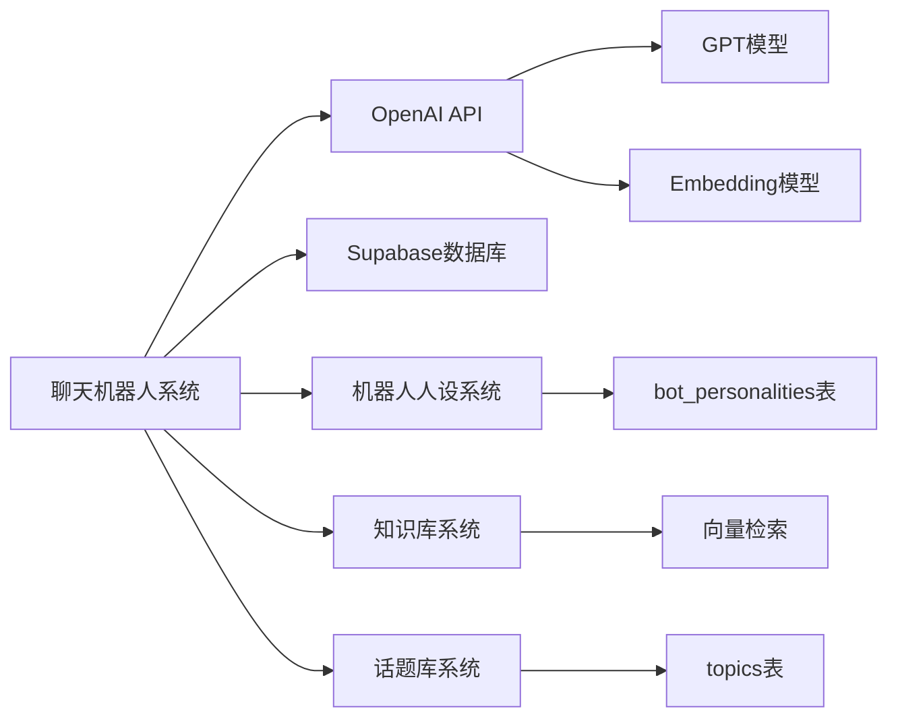

# 聊天机器人系统功能地图

## 系统功能总览

```mermaid
graph TB
    A[聊天机器人系统] --> B[用户管理模块]
    A --> C[会话管理模块]
    A --> D[消息处理模块]
    A --> E[LLM集成模块]
    A --> F[向量检索模块]
    A --> G[标签系统模块]
    A --> H[话题推送模块]
    A --> I[测试界面模块]
    
    B --> B1[聊天用户管理]
    B --> B2[用户标签管理]
    B --> B3[用户状态跟踪]
    
    C --> C1[会话创建]
    C --> C2[会话配置]
    C --> C3[会话状态管理]
    
    D --> D1[消息接收]
    D --> D2[消息合并处理]
    D --> D3[消息历史查询]
    
    E --> E1[OpenAI集成]
    E --> E2[自定义LLM接口]
    E --> E3[Prompt构建]
    
    F --> F1[消息向量化]
    F --> F2[相似性检索]
    F --> F3[上下文检索]
    
    G --> G1[标签定义]
    G --> G2[自动标签分配]
    G --> G3[标签查询]
    
    H --> H1[话题库管理]
    H --> H2[定时推送]
    H --> H3[个性化话题]
    
    I --> I1[用户界面]
    I --> I2[API测试]
    I --> I3[日志监控]
```



## 核心模块详解

### 1. 用户管理模块 👥

**位置**: `/api/chat/users`
**依赖关系**:
- 依赖: 数据库表 `chat_users`, `chat_user_tags`, `chat_user_tag_relations`
- 被依赖: 会话管理模块、消息处理模块、标签系统模块

**子功能**:
- **聊天用户CRUD** (`GET/POST/PUT/DELETE /api/chat/users`)
  - 创建聊天终端用户
  - 查询用户信息和标签
  - 更新用户资料
  - 软删除用户
- **用户标签管理**
  - 自动分配"新用户"标签
  - 查询用户所有标签
  - 标签颜色和描述管理

**数据流**:
```
用户创建 → 存储到chat_users → 自动分配标签 → 返回用户信息+标签
```

### 2. 会话管理模块 💬

**位置**: `/api/chat/sessions`
**依赖关系**:
- 依赖: 用户管理模块、机器人人设系统 (`bot_personalities`)
- 被依赖: 消息处理模块、话题推送模块

**子功能**:
- **会话生命周期管理** (`GET/POST/PUT/DELETE /api/chat/sessions`)
  - 创建新会话
  - 配置消息合并参数
  - 配置话题推送设置
  - 会话状态跟踪
- **会话配置**
  - `message_merge_seconds`: 消息合并间隔
  - `topic_trigger_hours`: 话题推送间隔
  - `is_topic_enabled`: 话题推送开关

**数据流**:
```
用户选择 → 会话创建 → 关联机器人人设 → 配置参数 → 开始对话
```

### 3. 消息处理模块 ⚡

**位置**: `/api/chat/message`
**依赖关系**:
- 依赖: 会话管理模块、LLM集成模块、向量检索模块
- 被依赖: 测试界面模块

**子功能**:
- **消息接收** (`POST /api/chat/message`)
  - 接收用户消息
  - 标记为未处理状态
  - 更新会话时间戳
- **消息批量处理** (`PUT /api/chat/message`)
  - 检查合并时间条件
  - 合并多条用户消息
  - 调用LLM生成回复
  - 存储AI回复
  - 标记消息为已处理
- **消息历史查询** (`GET /api/chat/message`)
  - 分页获取消息历史
  - 支持状态过滤

**数据流**:
```
用户发送消息 → 存储(未处理) → 定时检查 → 合并消息 → LLM调用 → 存储回复 → 标记已处理
```

### 4. LLM集成模块 🤖

**位置**: `src/lib/llm-service.ts`
**依赖关系**:
- 依赖: OpenAI API、机器人人设系统
- 被依赖: 消息处理模块、向量检索模块

**子功能**:
- **聊天补全服务**
  - `chat()`: 单轮对话
  - `chatWithHistory()`: 多轮对话
  - 支持温度、模型、Token数等参数配置
- **文本向量化**
  - `generateEmbedding()`: 生成文本embedding
  - 支持不同embedding模型
- **Prompt构建**
  - 动态构建系统Prompt
  - 集成机器人人设信息
  - 历史对话上下文处理

**数据流**:
```
消息内容 + 历史 + 人设 → 构建Prompt → LLM调用 → 生成回复
文本内容 → embedding生成 → 向量存储
```

### 5. 向量检索模块 🔍

**位置**: 计划中 (与`chat_vectors`表关联)
**依赖关系**:
- 依赖: LLM集成模块、数据库向量表
- 被依赖: 消息处理模块、知识库系统

**子功能**:
- **消息向量化存储**
  - 将聊天消息转为向量
  - 支持不同向量类型 (message/summary/context)
  - JSON格式存储，兼容pgvector
- **相似性检索**
  - 基于余弦相似度的检索
  - 支持会话内检索
  - 支持跨会话检索
- **上下文增强**
  - 为LLM提供相关历史上下文
  - 知识库内容检索

**数据流**:
```
消息内容 → 向量化 → 存储到chat_vectors → 检索查询 → 相似消息返回
```

### 6. 标签系统模块 🏷️

**位置**: 数据库函数 + API集成
**依赖关系**:
- 依赖: 用户管理模块
- 被依赖: 用户分析、个性化推荐

**子功能**:
- **标签定义管理**
  - 系统预设标签
  - 自定义标签创建
  - 标签颜色和描述
- **自动标签分配**
  - 新用户标签
  - 活跃度标签
  - 行为分析标签 (计划中)
- **标签查询和统计**
  - 用户标签列表
  - 标签用户统计
  - 标签趋势分析

**数据流**:
```
用户行为 → 标签规则匹配 → 自动分配标签 → 用户标签更新
```

### 7. 话题推送模块 📢

**位置**: 计划中 (与定时任务集成)
**依赖关系**:
- 依赖: 会话管理模块、话题库系统
- 被依赖: 消息处理模块

**子功能**:
- **话题库管理**
  - 预设话题存储
  - 话题分类管理
  - 个性化话题生成
- **定时推送机制**
  - 检查会话空闲时间
  - 符合条件的话题推送
  - 推送频率控制
- **个性化推荐**
  - 基于用户标签的话题选择
  - 基于聊天历史的话题生成
  - 时间相关话题 (节日、天气等)

**数据流**:
```
定时任务 → 检查空闲会话 → 选择合适话题 → 发送话题消息 → 更新会话状态
```

### 8. 测试界面模块 🧪

**位置**: `/test-chat`
**依赖关系**:
- 依赖: 所有API模块
- 被依赖: 无

**子功能**:
- **用户操作界面**
  - 用户创建和选择
  - 会话ID输入 (测试用)
  - 消息发送界面
- **系统操作界面**
  - 手动触发消息处理
  - 实时聊天展示
  - 操作日志显示
- **调试和监控**
  - API调用状态显示
  - 错误信息展示
  - 性能指标监控

**数据流**:
```
用户操作 → API调用 → 结果展示 → 日志记录
```

## 系统集成关系

### 数据库层级关系

```
chat_users (聊天用户)
    ↓ 一对多
chat_sessions (会话)
    ↓ 一对多  
chat_messages (消息) → chat_vectors (向量)
    ↑ 
chat_user_tags (标签) ← chat_user_tag_relations (关联) → chat_users
```

### API调用链路

1. **用户注册流程**:
   ```
   POST /api/chat/users → 创建用户 → 自动分配标签 → 返回用户信息
   ```

2. **会话创建流程**:
   ```
   POST /api/chat/sessions → 验证用户 → 关联人设 → 创建会话 → 返回会话信息
   ```

3. **消息处理流程**:
   ```
   POST /api/chat/message → 存储消息 → 更新时间戳
   PUT /api/chat/message → 检查合并条件 → 调用LLM → 存储回复
   ```

4. **消息查询流程**:
   ```
   GET /api/chat/message → 查询历史 → 分页返回 → 前端展示
   ```

### 外部系统集成



## 功能开发优先级

### Phase 1: 核心功能 (已完成) ✅
- [x] 用户管理模块
- [x] 会话管理模块  
- [x] 消息处理模块
- [x] LLM集成模块
- [x] 测试界面模块

### Phase 2: 增强功能 (进行中) 🚧
- [ ] 向量检索模块完整实现
- [ ] 标签系统自动化
- [ ] 话题推送机制
- [ ] 定时任务系统

### Phase 3: 高级功能 (计划中) 📋
- [ ] 知识库集成
- [ ] 自定义LLM切换
- [ ] 数据分析和报表
- [ ] 性能优化

### Phase 4: 扩展功能 (远期) 🔮
- [ ] 多租户支持
- [ ] 微服务架构
- [ ] 移动端适配
- [ ] 国际化支持

## 技术债务和待优化项

### 当前技术债务
1. **错误处理**: API错误码不够详细
2. **数据验证**: 输入参数验证需要加强
3. **性能优化**: 消息查询分页优化
4. **测试覆盖**: 单元测试和集成测试
5. **文档完善**: API文档和代码注释

### 架构优化计划
1. **服务抽象**: LLM服务提供者抽象
2. **缓存策略**: Redis缓存热点数据
3. **异步处理**: 消息处理队列化
4. **监控告警**: 系统监控和日志分析

## 相关文档链接

- **开发日志**: `@Docs/DevLog/2024-12-19_progress.md`
- **功能规则**: `@Docs/Feature/chatbot_system_rules.md`
- **技术债务**: `@Docs/TechDebt.md`
- **数据库设计**: `database/chatbot_schema.sql`
- **API实现**: 
  - `src/app/api/chat/users/route.ts`
  - `src/app/api/chat/sessions/route.ts`
  - `src/app/api/chat/message/route.ts`
- **服务层**: `src/lib/llm-service.ts`
- **测试界面**: `src/app/test-chat/page.tsx`