# 聊天机器人管理系统功能地图

## 系统架构概览

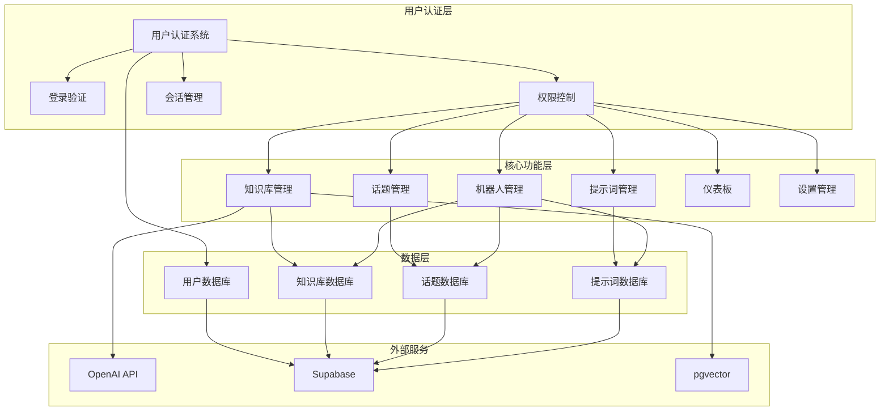

## 功能模块详细地图

### 1. 用户认证系统 🔐

**核心职责**: 系统安全守护，权限控制中心

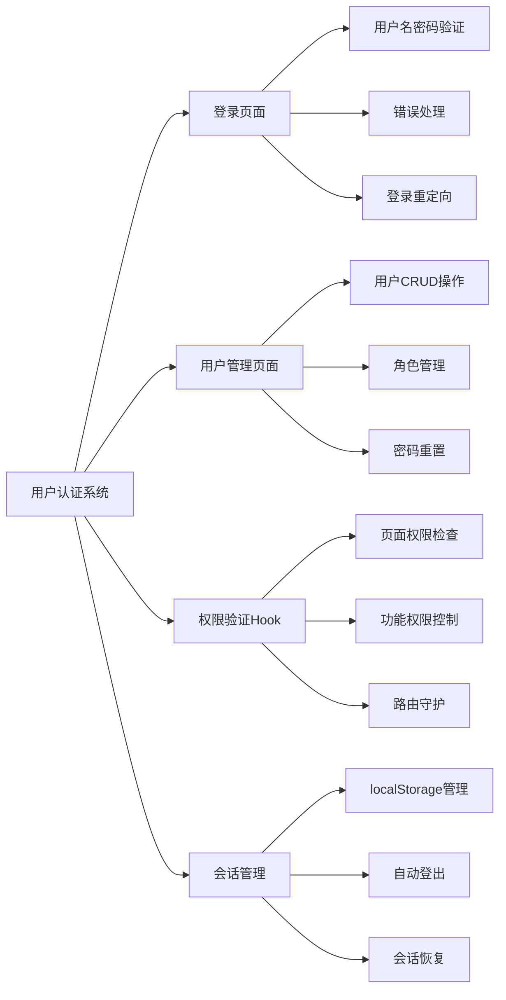

**权限级别**:
- `super_admin`: 完全访问权限
- `admin`: 管理所有业务功能
- `operator`: 管理知识库和话题
- `viewer`: 仅查看用户信息

**依赖关系**:
- **数据依赖**: `users`表
- **技术依赖**: Supabase认证、bcrypt加密
- **被依赖**: 所有其他功能模块

---

### 2. 知识库管理系统 🧠

**核心职责**: AI智能检索，知识内容管理

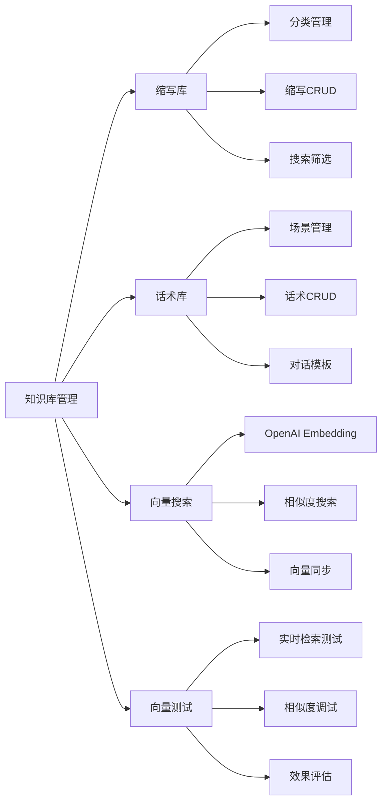

**技术特色**:
- **AI驱动**: OpenAI Embedding自动向量化
- **智能检索**: 语义相似度搜索
- **双模式**: 结构化存储 + 向量化检索
- **实时同步**: 数据变更自动更新向量

**依赖关系**:
- **权限依赖**: `operator`及以上权限
- **数据依赖**: `knowledge_abbreviations`, `knowledge_scripts`, `knowledge_vectors`
- **技术依赖**: OpenAI API, pgvector扩展
- **API端点**: `/api/search`, `/api/vectorize`

---

### 3. 话题管理系统 💬

**核心职责**: 对话内容组织，三级分类管理

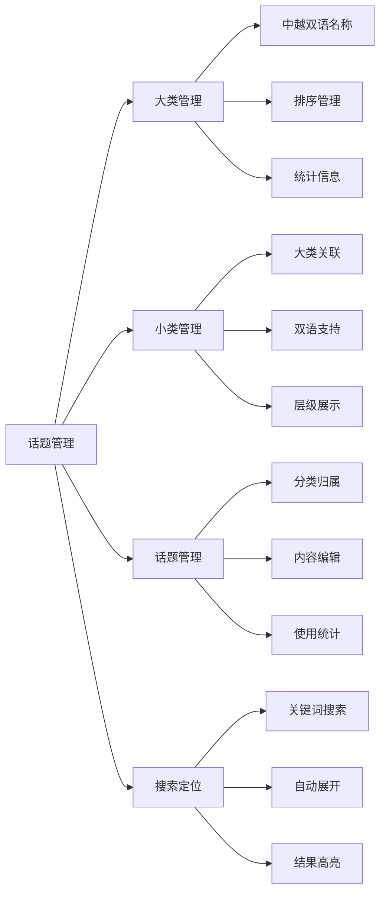

**设计特色**:
- **三级结构**: 大类 → 小类 → 具体话题
- **双语支持**: 中文/越南语并行管理
- **智能交互**: 展开/收起、搜索定位
- **排序灵活**: 从1000开始的排序系统

**依赖关系**:
- **权限依赖**: `operator`及以上权限
- **数据依赖**: `topic_categories`, `topic_subcategories`, `topics`
- **级联关系**: 删除大类自动删除小类和话题

---

### 4. 提示词管理系统 📝

**核心职责**: AI对话引导，多阶段模板管理

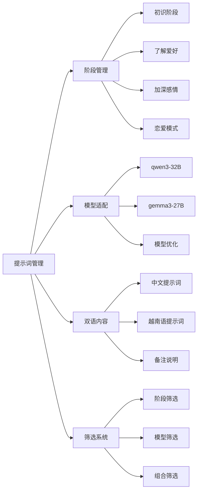

**设计特色**:
- **阶段化**: 按对话发展阶段组织
- **色彩编码**: 不同阶段使用专属颜色
- **智能展开**: 长内容自动折叠/展开
- **筛选统计**: 实时显示筛选结果数量

**依赖关系**:
- **权限依赖**: `operator`及以上权限
- **数据依赖**: `prompts`表
- **功能关联**: 为机器人管理提供模板支持

---

### 5. 机器人管理系统 🤖

**核心职责**: 聊天机器人配置，综合功能整合

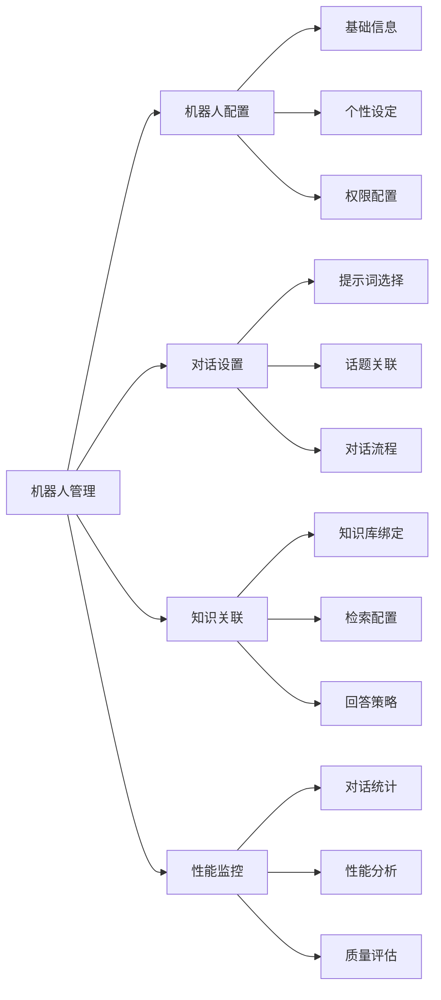

**整合特色**:
- **多功能整合**: 整合提示词、话题、知识库
- **个性化配置**: 每个机器人独立配置
- **智能对话**: 基于知识库的智能回答
- **效果监控**: 对话质量和性能分析

**依赖关系**:
- **权限依赖**: `admin`及以上权限
- **功能依赖**: 提示词管理、话题管理、知识库管理
- **数据整合**: 跨模块数据关联和配置

---

### 6. 仪表板系统 📊

**核心职责**: 数据概览，系统状态监控

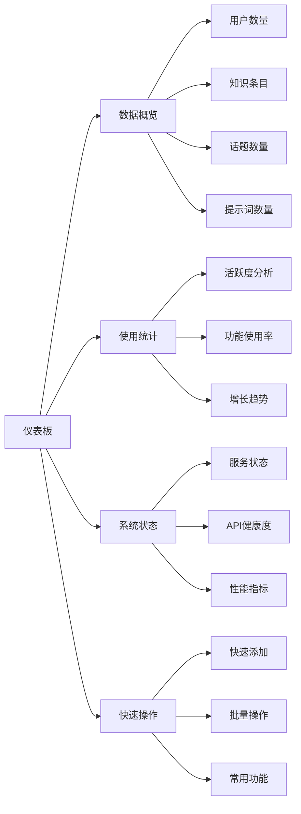

**分析特色**:
- **全局视角**: 系统整体数据概览
- **趋势分析**: 历史数据变化趋势
- **健康监控**: 系统服务状态监控
- **快速入口**: 常用功能快速访问

**依赖关系**:
- **权限依赖**: `viewer`及以上权限
- **数据依赖**: 所有模块的统计数据
- **展示层**: 汇总展示各模块核心指标

---

### 7. 设置管理系统 ⚙️

**核心职责**: 系统配置，高级管理功能

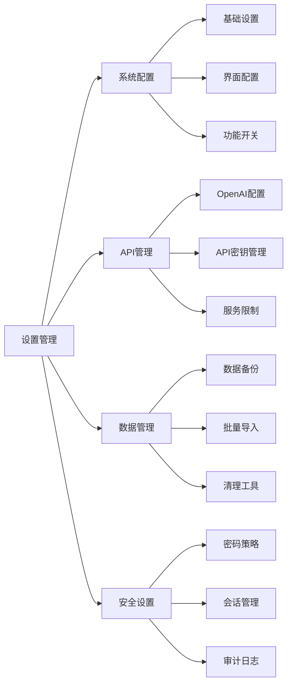

**管理特色**:
- **高级配置**: 系统级参数设置
- **API管理**: 外部服务密钥和配置
- **数据工具**: 备份、导入、清理功能
- **安全策略**: 密码、会话、审计管理

**依赖关系**:
- **权限依赖**: `super_admin`权限
- **系统级**: 影响整个系统的配置和行为
- **维护工具**: 提供系统维护和管理工具

## 数据流向图

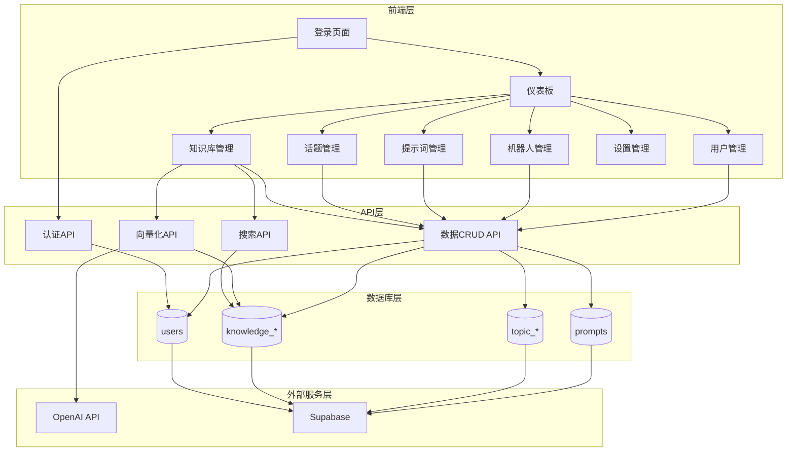

## 技术栈依赖关系

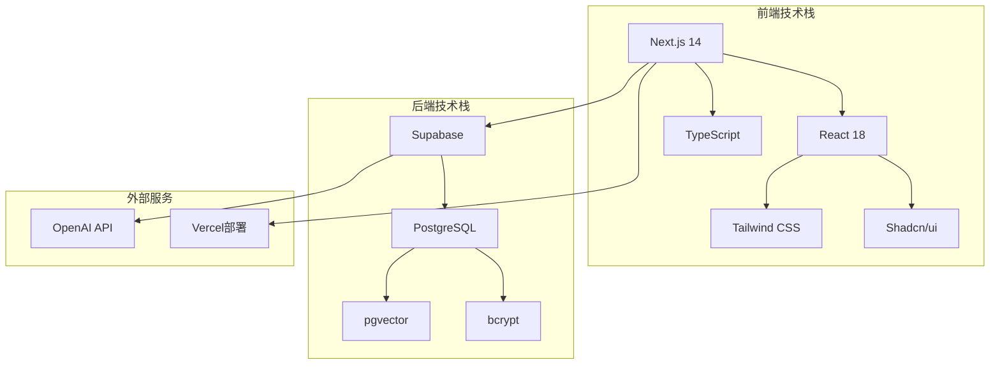

## 部署架构图

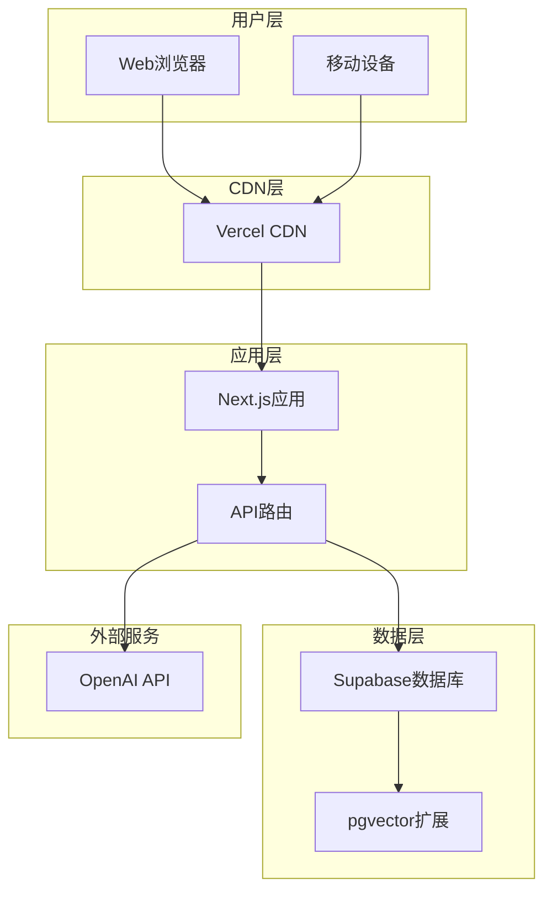

## 功能模块统计

| 模块 | 状态 | 权限要求 | 主要文件 | 依赖服务 |
|------|------|----------|----------|----------|
| 用户认证 | ✅ 已完成 | - | `page.tsx`, `users/page.tsx` | Supabase |
| 知识库管理 | ✅ 已完成 | operator+ | `knowledge/page.tsx` | OpenAI, pgvector |
| 话题管理 | ✅ 已完成 | operator+ | `topics/page.tsx` | Supabase |
| 提示词管理 | ✅ 已完成 | operator+ | `prompts/page.tsx` | Supabase |
| 机器人管理 | 🚧 规划中 | admin+ | `bots/page.tsx` | 多服务整合 |
| 仪表板 | 🚧 规划中 | viewer+ | `dashboard/page.tsx` | 数据聚合 |
| 设置管理 | 🚧 规划中 | super_admin | `settings/page.tsx` | 系统配置 |

## 核心API端点

| 端点 | 方法 | 功能 | 权限 | 依赖模块 |
|------|------|------|------|----------|
| `/api/search` | POST | 向量搜索 | operator+ | 知识库, OpenAI |
| `/api/vectorize` | POST/DELETE | 向量化管理 | operator+ | 知识库, OpenAI |
| `/` | POST | 用户登录 | - | 用户认证 |
| `/users` | GET/POST/PUT/DELETE | 用户管理 | admin+ | 用户认证 |
| `/knowledge` | GET/POST/PUT/DELETE | 知识库CRUD | operator+ | 知识库 |
| `/topics` | GET/POST/PUT/DELETE | 话题CRUD | operator+ | 话题管理 |
| `/prompts` | GET/POST/PUT/DELETE | 提示词CRUD | operator+ | 提示词管理 |

## 下一步开发规划

### 短期目标 (1-2周)
1. **完善机器人管理功能**
   - 机器人配置界面
   - 多模块数据整合
   - 对话流程配置

2. **实现仪表板功能**
   - 数据统计概览
   - 使用趋势分析
   - 系统状态监控

### 中期目标 (1个月)
1. **增强设置管理**
   - 系统配置界面
   - API密钥管理
   - 数据备份工具

2. **性能优化**
   - 数据库查询优化
   - 前端性能提升
   - 缓存策略实现

### 长期目标 (3个月)
1. **安全增强**
   - 审计日志系统
   - 双因素认证
   - API安全加固

2. **功能扩展**
   - 多语言支持扩展
   - 高级分析功能
   - 自动化工具

## 维护和监控

### 日常维护
- [ ] 数据库性能监控
- [ ] API响应时间检查
- [ ] 用户活动日志审查
- [ ] 知识库质量评估

### 定期任务
- [ ] 数据备份验证
- [ ] 安全漏洞扫描
- [ ] 依赖包更新
- [ ] 性能优化分析

### 紧急响应
- [ ] 系统故障快速恢复
- [ ] 数据丢失应急处理
- [ ] 安全事件响应流程
- [ ] 用户支持快速通道

---

**文档版本**: v1.0  
**最后更新**: 2024年12月
**维护者**: 开发团队 