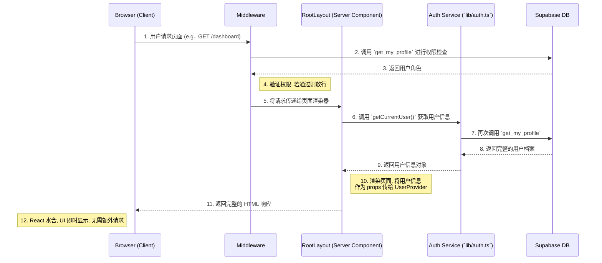

# 客户端-服务端-数据库交互架构文档

## 架构交互流程图

## 1. 架构总览

本项目采用基于 Next.js App Router 的现代化Web架构。其核心是一种**服务端组件驱动 (Server Component-Driven)** 的数据获取模式，并由中间件提供前置的安全保障。

此架构旨在最大化服务器端组件 (Server Components) 的优势。**中间件 (`middleware.ts`)** 作为应用的第一道防线，统一处理身份验证和路由级的权限控制。通过验证后，请求会到达相应的页面。页面的服务器组件（如根布局 `src/app/layout.tsx`）则通过调用专门的**认证服务 (`src/lib/auth.ts`)** 来直接获取自身渲染所需的数据。

获取到的数据最终作为初始状态 (initial props) 传递给客户端的 React Context (`UserProvider`)。这种模式根治了客户端因重复请求数据而导致的首次加载慢和UI闪烁问题，实现了清晰的职责分离和高效、明确的数据流。

---

## 2. 核心组件职责

### 2.1. 数据库层 (Supabase)

- **文件**: `database/07_auth_rls.sql`
- **核心函数**:
    - `get_my_profile()`: 这是最关键的函数，它作为单一的数据源，通过一次数据库查询，就能获取当前登录用户的完整信息，包括用户名、邮箱、全名以及最重要的**用户角色 (`role`)**。它通过 `auth.uid()` 来安全地识别当前用户。

### 2.2. 服务端层 (Next.js Backend)

#### a. 中间件 (`src/middleware.ts`) - 应用的“安全网关”

中间件是所有受保护路由的第一个接触点，仅专注于**认证和鉴权**。

- **职责**:
    1.  **会话验证**: 检查用户是否已登录。如果未登录，则重定向到 `/login` 页面。
    2.  **权限控制**: 为了执行权限判断，它会调用数据库的 `get_my_profile()` 函数获取用户角色。基于角色，它会调用 `hasPagePermission()` 函数判断用户是否有权访问请求的路径。如果无权，则重定向到该角色的默认页面。
    3.  **放行请求**: 验证通过后，将请求放行至 Next.js 的页面渲染器。**它不会向请求中注入任何数据。**

#### b. 认证服务 (`src/lib/auth.ts`) - 服务端数据源

这是一个新增的服务模块，是服务器端获取用户信息的唯一入口。

- **职责**:
    1.  **封装逻辑**: 提供了 `getCurrentUser()` 函数，该函数封装了创建 Supabase 服务端客户端、获取会话、调用 `get_my_profile` RPC 以及处理错误的完整逻辑。
    2.  **服务复用**: 任何服务器端环境（Server Components, API Routes, Server Actions）都可以通过调用此函数来安全地获取当前用户信息。

#### c. 根布局 (`src/app/layout.tsx`) - 数据获取与传递的“桥梁”

根布局是一个**异步服务器组件 (Async Server Component)**，它负责在服务器端获取渲染UI所需的初始用户数据。

- **职责**:
    1.  **直接获取数据**: 它通过 `await getCurrentUser()` 直接调用认证服务来获取完整的用户信息 (`userProfile`)。这是为UI准备数据的**首次**也是**唯一一次**调用。
    2.  **传递初始状态**: 在渲染 `<UserProvider>` 组件时，将获取到的 `userProfile` 和 `userRole` 作为 `initialProfile` 和 `initialRole` 这两个 props 传递下去。

### 2.3. 客户端层 (React Frontend)

#### a. 用户上下文 (`src/components/user-context.tsx`) - 全局状态中心

这是一个客户端组件 (`'use client'`)，负责在整个应用中共享用户信息。

- **职责**:
    1.  **接收初始状态**: 它从服务器组件 `RootLayout` 接收 `initialProfile` 和 `initialRole` 作为 props。
    2.  **初始化 State**: 使用接收到的 props 来初始化 `useState`，将用户信息存储在 React state 中。
    3.  **杜绝客户端请求**: 它**不包含任何 `useEffect` 数据获取逻辑**。数据在组件挂载时就已经存在，因此 `loading` 状态默认为 `false`。
    4.  **提供数据**: 通过 React Context，将 `userProfile`、`userRole` 等信息提供给所有需要它们的子组件。

#### b. UI组件 (`src/components/layout/sidebar.tsx`, `user-menu.tsx`) - 数据消费方

这些是纯粹的UI组件，负责展示用户信息和根据权限动态渲染导航。

- **职责**:
    1.  **消费数据**: 通过 `useUser()` hook 从 `UserContext` 中获取用户信息和加载状态。
    2.  **渲染UI**: 根据获取到的 `userRole` 和 `userProfile` 来决定显示哪些菜单项、用户的名字等。

---

## 3. 请求生命周期与数据流

以下是一个用户首次访问受保护页面（如 `/dashboard`）的完整流程：

1.  **[浏览器]** -> **[服务器]**: 用户发起 `GET /dashboard` 请求。
2.  **[中间件]**: `middleware.ts` 拦截请求。
    - 验证用户 Cookie，确认已登录。
    - 调用 `get_my_profile()` 获取用户角色，并检查用户是否有权访问 `/dashboard`。
    - 将请求放行至 Next.js 页面渲染器。
3.  **[服务器渲染]**: Next.js 开始渲染 `src/app/layout.tsx` 服务器组件。
    - `layout.tsx` **执行一次 `await getCurrentUser()`**，获取到完整的用户信息。
    - `layout.tsx` 将解析后的用户信息作为 props (`initialProfile`, `initialRole`) 传递给 `<UserProvider>`。
4.  **[服务器渲染]**: Next.js 继续渲染子页面（如 `dashboard/page.tsx`）和客户端组件（如 `Sidebar`）。
    - 此时，服务器已经生成了包含了所有用户数据的完整 HTML。
5.  **[服务器]** -> **[浏览器]**: 服务器将最终的 HTML 响应发送给浏览器。
6.  **[浏览器]**: 浏览器接收到 HTML 并开始渲染。
    - React 进行水合 (Hydration)。`<UserProvider>` 被初始化，其 `useState` 直接使用从服务器传递来的 `initialProfile` 和 `initialRole` 进行赋值。
    - `<Sidebar>` 和 `<UserMenu>` 通过 `useUser()` hook 立即获得用户信息，**无需任何加载过程**，直接渲染出最终的UI。

这个流程确保了数据获取的逻辑与需要该数据的组件紧密耦合，同时认证和鉴权的职责由中间件清晰地分离，浏览器端依然获得了极速的、无闪烁的渲染体验。

---

## 4. 核心库、钩子与API端点 (Core Libraries, Hooks & API Endpoints)

除了构成核心数据流的组件外，项目还包含一系列共享的库、自定义钩子和API端点，它们为应用提供了基础功能和业务逻辑支持。

### 4.1. `lib` 目录 - 共享函数库

此目录存放了整个应用中可复用的核心逻辑和配置。

-   **`permissions.ts` - 权限与菜单配置中心**
    -   **职责**: 这是应用的**角色权限体系 (RBAC) 的唯一真实来源**。它定义了所有用户角色（`user`, `admin`, `super_admin`）、所有可能的菜单项，以及每个角色可以访问的页面和菜单。
    -   **关键函数**:
        -   `hasPagePermission(role, page)`: 在中间件中使用，判断特定角色是否有权访问某个页面。
        -   `getMenuItems(role)`: 在 `Sidebar` 组件中使用，根据用户角色动态生成导航菜单。

-   **`supabase-client.ts` & `supabase-server.ts` - Supabase 客户端工厂**
    -   **职责**: 提供了用于创建 Supabase 客户端实例的标准化函数，区分了不同的运行环境。
    -   **`supabase-client.ts`**:
        -   `createClient()`: 创建用于**浏览器环境**的客户端，使用公开的 `anon` key。
        -   `createAdminClient()`: 创建用于**需要管理员权限的API路由**的客户端，使用高权限的 `service_role_key`。
    -   **`supabase-server.ts`**:
        -   `createServerActionClient()`: 创建用于**服务器组件、Server Actions 和 API 路由**的客户端，能够安全地处理用户的会话 Cookie。

-   **`error-handler.ts` - 统一错误处理器**
    -   **职责**: 提供一个 `handleError` 函数，用于以统一的、结构化的JSON格式记录错误。这取代了零散的 `console.error` 调用，便于未来的日志聚合和分析。

-   **`i18n.ts` - 国际化配置**
    -   **职责**: 使用 `i18next` 和 `react-i18next` 初始化国际化配置。它预加载了中、英、越三种语言的翻译资源，并配置了语言检测器（优先使用 `localStorage`）。

-   **`utils.ts` - 样式工具函数**
    -   **职责**: 提供 `cn` 函数，它是 `clsx` 和 `tailwind-merge` 的结合，用于优雅地合并和覆盖 Tailwind CSS 类名，避免样式冲突。

### 4.2. `hooks` 目录 - 客户端自定义钩子

-   **`use-mounted.ts` - 客户端挂载状态钩子**
    -   **职责**: 提供一个 `useMounted` 钩子，它在组件于客户端成功挂载后返回 `true`。这主要用于解决服务端渲染 (SSR) 和客户端渲染 (CSR) 之间可能出现的UI不一致问题（水合错误），例如，确保只在客户端渲染某些依赖浏览器环境的UI。

### 4.3. `api` 目录 - 服务端点

这些是 Next.js 的 API Routes，为客户端提供了执行特定服务端操作的接口。

-   **`api/auth/login/route.ts` - 用户登录接口**
    -   **职责**: 处理用户的登录请求。
    -   **流程**:
        1.  接收 `username` 和 `password`。
        2.  调用数据库函数 `get_email_by_username` 将用户名安全地转换为邮箱地址。
        3.  使用获取到的邮箱和用户提供的密码，调用 Supabase 的 `signInWithPassword` 方法完成认证。
        4.  为了安全，无论是用户名错误还是密码错误，都返回统一的 "Invalid username or password" 错误信息，以防止用户枚举攻击。

-   **`api/admin/create-user/route.ts` - (管理员) 创建用户接口**
    -   **职责**: 允许管理员创建新用户。这是一个高权限操作。
    -   **流程**:
        1.  接收 `email`, `password`, `username`, 和 `role`。
        2.  **（TODO）** 此接口目前缺少权限校验，需要补充逻辑以确保只有管理员或超级管理员才能调用。
        3.  使用 `createAdminClient` 创建一个具有服务角色的 Supabase 客户端。
        4.  通过 `supabase.auth.admin.createUser` 在 Auth 系统中创建用户。
        5.  数据库触发器会自动在 `public.users` 表中创建一条关联记录，此接口随后会更新这条记录，设置其 `username` 和 `role`。
