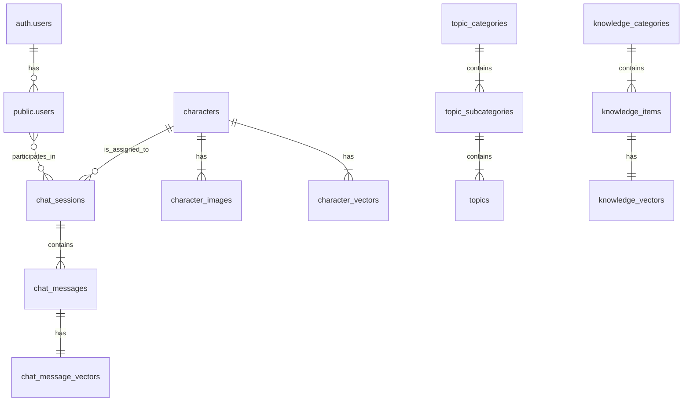

# 数据模型与权限矩阵

> **目标**: 基于最新的数据库 Schema，本文档定义了统一的数据模型、实体关系、权限策略和自动化逻辑。

## 1. 命名与数据约定

- **语言与多语言字段**:
  - 系统支持三种语言, 定义为 `language_type` ENUM: `'en'` (英文), `'zh'` (中文), `'vi'` (越南语)。
  - **核心内容表** (`topics`, `knowledge_items`, `prompts` 等) 统一采用“长表”模式：使用 `language language_type` 字段来区分不同语言的记录。
  - **分类或辅助表** (`topic_categories`, `characters` 等) 在需要多语言支持时，采用“宽表”模式：字段统一采用 `name_en`, `name_zh`, `name_vi` 的形式。
- **软删除**:
  - 所有核心表都包含 `is_deleted BOOLEAN` 字段，默认为 `FALSE`。
  - RLS 策略确保普通用户无法查询到 `is_deleted = TRUE` 的记录。
- **主键与时间戳**:
  - 主键统一为 `id UUID`，使用 `gen_random_uuid()` 生成。
  - 所有表都包含 `created_at TIMESTAMPTZ` 和 `updated_at TIMESTAMPTZ`。
  - `updated_at` 字段通过 `update_updated_at_column()` 触发器在每次更新时自动刷新。
- **向量化**:
  - 核心内容表（如 `characters`, `knowledge_items`, `chat_messages`）都关联一个向量表。
  - 向量表包含 `embedding vector(1536)` 字段，存储 OpenAI `text-embedding-3-small` 模型生成的向量。

---

## 2. 模块化实体与关系 (ER)

### 2.1. 按模块划分的实体

#### A. 用户与认证模块 (Auth Module)
- **表**: `users`
- **描述**: 存储面板用户公开信息，通过 `id` 与 `auth.users` 表一对一关联。
- **核心字段**: `id (FK)`, `username`, `role` (`user_role` ENUM), `full_name`

#### B. 聊天对话模块 (Chat Module)
- **表**: `chat_users`, `chat_sessions`, `chat_messages`, `chat_message_vectors`
- **描述**: 构成了聊天功能的核心，记录了跨平台用户、会话、具体消息以及消息的向量化数据。
- **核心关系**: `chat_users` 1—N `chat_sessions` 1—N `chat_messages` 1—1 `chat_message_vectors`

#### C. 话题管理模块 (Topics Module)
- **表**: `topic_categories`, `topic_subcategories`, `topics`
- **描述**: 存储了结构化的话题内容，支持两级分类。
- **核心关系**: `topic_categories` 1—N `topic_subcategories` 1—N `topics`

#### D. 知识库模块 (Knowledge Module)
- **表**: `knowledge_categories`, `knowledge_items`, `knowledge_vectors`
- **描述**: 采用统一模型管理“缩写” (`abbreviation`) 和“话术” (`script`) 两类知识。
- **核心关系**: `knowledge_categories` 1—N `knowledge_items` 1—1 `knowledge_vectors`

#### E. 提示词模块 (Prompts Module)
- **表**: `prompts`
- **描述**: 存储用于指导 AI 模型的系统提示词。

#### F. 角色人设模块 (Characters Module)
- **表**: `characters`, `character_images`, `character_vectors`
- **描述**: 替代旧的 `bot_personalities`，提供更丰富的角色定义，包括基础信息、图片以及多维度向量。
- **核心关系**: `characters` 1—N `character_images`, `characters` 1—N `character_vectors`

### 2.2. 实体关系图 (ERD)

---

## 3. RLS / 角色权限矩阵

系统采用 Supabase Auth (JWT) 结合 PostgreSQL 的行级安全 (RLS) 策略进行权限控制。核心函数 `public.get_my_role()` 用于在数据库层面获取当前认证用户的角色。

| 模块/表 | 角色 | SELECT (读取) | INSERT (创建) | UPDATE (更新) | DELETE (物理删除) | 软删除 (更新 is_deleted) |
| :--- | :--- | :--- | :--- | :--- | :--- | :--- |
| **Topics** | `user` | ✅ (仅 `is_deleted=false`) | ❌ | ❌ | ❌ | ❌ |
| | `admin`/`super_admin` | ✅ (所有) | ✅ | ✅ | ❌ | ✅ |
| **Knowledge** | `user` | ✅ (仅 `is_deleted=false`) | ❌ | ❌ | ❌ | ❌ |
| | `admin`/`super_admin` | ✅ (所有) | ✅ | ✅ | ❌ | ✅ |
| **Prompts** | `user` | ✅ (仅 `is_deleted=false`) | ❌ | ❌ | ❌ | ❌ |
| | `admin`/`super_admin` | ✅ (所有) | ✅ | ✅ | ❌ | ✅ |
| **Characters** | `user` | ✅ (仅 `is_deleted=false`) | ❌ | ❌ | ❌ | ❌ |
| | `admin`/`super_admin` | ✅ (所有) | ✅ | ✅ | ❌ | ✅ |
| **Chat Data** | `user`/`admin`/`super_admin` | ✅ | 仅 `admin`/`super_admin` | 仅 `admin`/`super_admin` | ❌ | N/A |
| **Users** | `user`/`admin`/`super_admin` | ✅ | ❌ (触发器自动处理) | ✅ (仅限本人) | ❌ | N/A |

---

## 4. 触发器与自动化

- **新用户自动创建 Profile**:
  - **触发**: `auth.users` 表 `AFTER INSERT`
  - **动作**: `handle_new_user()` 函数被调用，在 `public.users` 表中创建关联记录。
- **`updated_at` 自动更新**:
  - **触发**: 所有核心表 `BEFORE UPDATE`
  - **动作**: `update_updated_at_column()` 函数被调用，自动更新 `updated_at` 时间戳。
- **软删除同步**:
  - **触发**: `characters`, `knowledge_items` 表 `AFTER UPDATE` (当 `is_deleted` 改变时)
  - **动作**: `synchronize_vector_soft_delete()` 函数被调用，将关联的向量表中的对应记录也标记为软删除。
- **自动向量化**:
  - **触发**: `characters`, `knowledge_items`, `chat_messages` 表 `AFTER INSERT OR UPDATE`
  - **动作**: `trigger_vectorization_request()` 函数被调用，通过 `pg_net` 异步调用 Edge Function (`vectorize-on-change`) 来处理内容的向量化和存储。