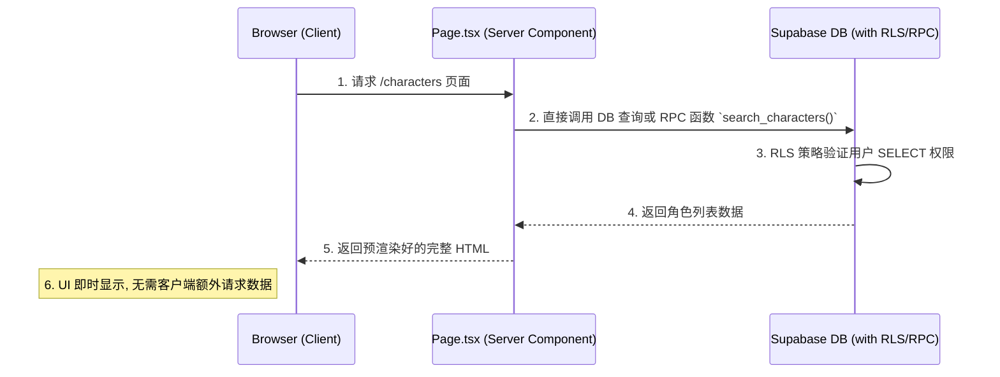
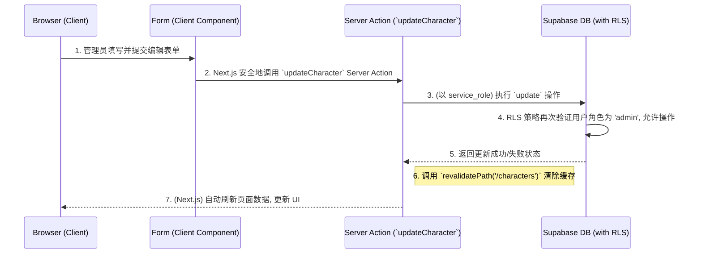
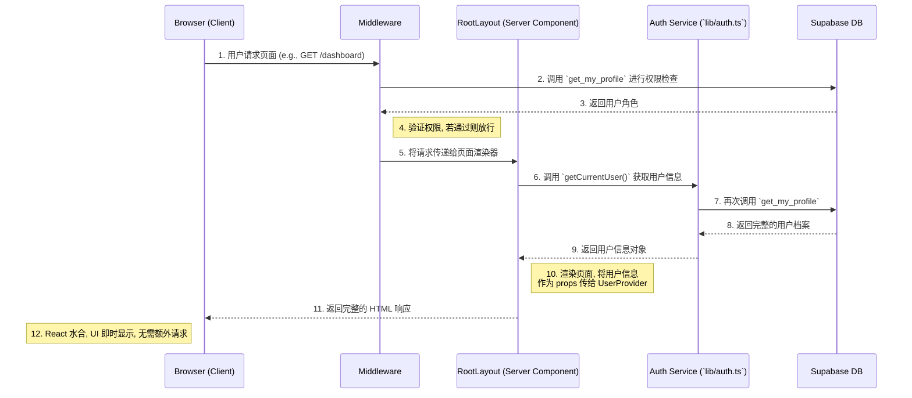

# 前端功能页面架构与交互

> **目标**: 为应用内的功能页面（如“角色管理”、“知识库管理”等）提供一个标准化的、可复用的架构模式，确保开发效率、性能和安全性。

## 1. 页面数据读取/写入流程模板

架构的核心是区分**数据读取 (Read)** 和**数据写入 (Write)** 两种场景，并采用不同的最优策略。

### 1.1. 数据读取流程 (Read Flow via Server Component)
此流程适用于列表页、详情页等只读场景，旨在实现最佳加载性能。

**核心思想**: 数据获取和页面渲染完全在服务端完成。



-   **实现**:
    1.  页面文件（如 `app/characters/page.tsx`）是一个**异步服务器组件 (`async function Page()`)**。
    2.  在该组件内部，直接 `await` 数据库客户端的查询请求。
    3.  查询结果直接作为 `props` 传递给渲染列表的客户端组件。

### 1.2. 数据写入流程 (Write Flow via Server Action)
此流程适用于创建、更新、删除等操作，旨在提供安全、流畅的交互体验，同时避免编写专门的 API 路由。

**核心思想**: 利用 Server Action 在服务端安全地执行变更，并通过 `revalidatePath` 自动更新UI。



-   **实现**:
    1.  定义一个 Server Action 函数（如 `updateCharacter`），通常放在独立的 `actions.ts` 文件中。
    2.  客户端组件（如表单）的 `onSubmit` 事件直接调用该 Action。
    3.  Action 内部执行数据库操作，并在成功后调用 `revalidatePath` 或 `revalidateTag` 来清除Next.js的数据缓存。
    4.  Next.js 会自动重新获取数据并更新受影响的UI部分。

---

## 2. 核心认证与数据流: `Middleware`→`Layout`→`UserProvider`

这是整个应用启动时，为客户端注入全局用户状态的核心链路。

### 2.1. 流程图



### 2.2. 组件职责

-   **`middleware.ts` (安全网关)**:
    -   负责所有受保护路由的**认证**和**鉴权**。
    -   检查会话，如未登录则重定向。
    -   调用数据库获取**角色**，判断页面访问权限。
    -   **不向请求中注入任何数据**，只负责放行或重定向。

-   **`layout.tsx` (数据获取桥梁)**:
    -   作为根服务器组件，在服务端**首次且唯一一次**调用 `getCurrentUser()` 来获取完整的用户信息。
    -   将获取到的用户信息 (`userProfile`) 作为 `initialProfile` prop 传递给客户端的 `<UserProvider>`。

-   **`user-context.tsx` (全局状态中心)**:
    -   是一个客户端组件 (`'use client'`)。
    -   接收来自 `layout.tsx` 的 `initialProfile` prop，并用它来初始化 `useState`。
    -   **不包含任何 `useEffect` 数据获取逻辑**，确保组件挂载时数据即已存在，避免UI闪烁。
    -   通过 React Context 向所有子组件提供全局的用户信息。

---

## 3. 权限化 UI

-   **核心职责**: 客户端组件的核心职责之一是根据从服务端接收的数据和用户的权限角色，动态地渲染 UI。
-   **实现方式**:
    1.  UI 组件通过 `useUser()` hook 从 `UserContext` 中获取当前用户的角色 (`userRole`)。
    2.  使用条件渲染（例如 `userRole === 'admin' && <Button>创建</Button>`）来决定是否显示敏感操作的 UI 元素（如“创建”、“编辑”、“删除”按钮）。
-   **安全提示**: 这是一种前端安全措施和良好的用户体验，但**真正的安全依赖于服务端 (Server Action) 和数据库 (RLS) 的强校验**。

---

## 4. 性能与一致性策略

-   **避免水合错误 (`use-mounted.ts`)**:
    -   提供一个 `useMounted` 钩子，它在组件于客户端成功挂载后返回 `true`。
    -   主要用于解决服务端渲染 (SSR) 和客户端渲染 (CSR) 之间可能出现的 UI 不一致问题。例如，确保只在客户端渲染某些依赖浏览器环境（如 `localStorage`）的 UI。

-   **智能缓存与自动刷新 (`revalidatePath`)**:
    -   Server Action 在完成数据写入后，通过调用 `revalidatePath` 来通知 Next.js 清除特定路径的数据缓存。
    -   这使得 Next.js 能够重新获取最新数据并将其发送到客户端，实现近乎实时的 UI 更新，而无需手动管理客户端状态。

-   **样式合并 (`utils.ts`)**:
    -   提供 `cn` 函数（结合 `clsx` 和 `tailwind-merge`），用于优雅地合并和覆盖 Tailwind CSS 类名，避免样式冲突，提升开发体验。

---

## 5. 前端项目文件结构

### 5.1. 整体目录概览

```
src/
├── app/                          # Next.js App Router 页面和 API 路由
│   ├── api/                      # API 路由
│   │   ├── admin/                # 管理员专用 API
│   │   │   └── create-user/      # 创建用户接口
│   │   └── auth/                 # 认证相关 API
│   │       └── login/            # 登录接口
│   ├── [页面目录]/               # 各功能页面
│   ├── globals.css               # 全局样式定义
│   ├── layout.tsx                # 根布局组件
│   └── page.tsx                  # 首页组件
├── components/                   # 可复用组件
│   ├── layout/                   # 布局相关组件
│   ├── ui/                       # 基础 UI 组件
│   ├── coming-soon.tsx           # 通用占位组件
│   ├── i18n-provider.tsx         # 国际化提供者
│   ├── theme-provider.tsx        # 主题提供者
│   └── user-context.tsx          # 用户状态管理
├── hooks/                        # 自定义 React Hook
├── lib/                          # 核心业务逻辑和工具
└── middleware.ts                 # Next.js 中间件

public/
└── locales/                      # 多语言资源文件
    ├── zh.json                   # 中文
    ├── en.json                   # 英文
    └── vi.json                   # 越南语
```

### 5.2. 详细文件结构与职责

#### 5.2.1. App Router 页面结构 (`src/app/`)

```
app/
├── api/                          # 服务端 API 路由
│   ├── admin/
│   │   └── create-user/
│   │       └── route.ts          # POST /api/admin/create-user - 管理员创建用户
│   └── auth/
│       └── login/
│           └── route.ts          # POST /api/auth/login - 用户登录验证
├── characters/
│   └── page.tsx                  # 人设管理页面
├── dashboard/
│   └── page.tsx                  # 仪表盘页面
├── knowledge/
│   └── page.tsx                  # 知识库管理页面
├── login/
│   ├── page.tsx                  # 登录页面（主要）
│   └── page copy.tsx             # 登录页面备份
├── permission/
│   └── page.tsx                  # 权限管理页面
├── prompts/
│   └── page.tsx                  # 提示词管理页面
├── settings/
│   └── page.tsx                  # 系统设置页面
├── test_chat/
│   └── page.tsx                  # 聊天测试页面
├── topics/
│   └── page.tsx                  # 话题库管理页面
├── ui_components/
│   └── page.tsx                  # UI 组件展示页面
├── users/                        # 用户管理（待开发）
├── favicon.ico                   # 网站图标
├── globals.css                   # 全局样式和 Tailwind 配置
├── layout.tsx                    # 根布局 - 认证、主题、国际化提供者
└── page.tsx                      # 首页 - 欢迎页面
```

**页面组件特点**:
- 大部分功能页面目前使用统一的 `ComingSoon` 占位组件
- `login/page.tsx` 是完整实现的登录界面，包含用户名/密码表单
- 所有页面都遵循 Next.js App Router 的约定

#### 5.2.2. 可复用组件结构 (`src/components/`)

```
components/
├── layout/                       # 布局相关组件
│   ├── app-shell.tsx            # 应用外壳 - 条件渲染侧边栏
│   ├── language-toggle.tsx      # 语言切换下拉菜单
│   ├── sidebar.tsx              # 主侧边栏 - 动态菜单、权限控制
│   ├── theme-toggle.tsx         # 主题切换按钮组
│   └── user-menu.tsx            # 用户菜单下拉 - 显示用户信息和登出
├── ui/                          # 基础 UI 组件（基于 Radix UI）
│   ├── button.tsx               # 按钮组件
│   ├── card.tsx                 # 卡片容器组件
│   ├── dropdown-menu.tsx        # 下拉菜单组件
│   ├── input.tsx                # 输入框组件
│   └── label.tsx                # 标签组件
├── coming-soon.tsx              # 通用占位页面组件
├── i18n-provider.tsx            # React i18next 提供者包装
├── theme-provider.tsx           # next-themes 提供者包装
└── user-context.tsx             # 用户状态 Context 和 Provider
```

**组件设计特点**:
- `layout/` 组件负责应用的整体布局和导航
- `ui/` 组件是基于 Radix UI 和 Tailwind 的设计系统组件
- Provider 组件负责全局状态管理（主题、国际化、用户状态）

#### 5.2.3. 业务逻辑与工具库 (`src/lib/`)

```
lib/
├── auth.ts                      # 服务端认证服务
│   ├── getCurrentUser()         # 获取当前用户完整信息
│   └── UserProfile interface    # 用户档案类型定义
├── error-handler.ts             # 统一错误处理和日志记录
├── i18n.ts                      # 国际化配置和初始化
├── permissions.ts               # 权限控制核心逻辑
│   ├── UserRole types           # 用户角色类型定义
│   ├── hasPagePermission()      # 页面访问权限检查
│   ├── getMenuItems()           # 基于角色的菜单项获取
│   └── MENU_CONFIG              # 菜单配置常量
├── supabase-client.ts           # Supabase 客户端创建工具
│   ├── createClient()           # 浏览器端客户端
│   └── createAdminClient()      # 服务端管理客户端
├── supabase-server.ts           # 服务端 Supabase 客户端
└── utils.ts                     # 通用工具函数（样式合并等）
```

**核心模块说明**:
- `auth.ts`: 处理服务端用户认证和会话管理
- `permissions.ts`: 实现基于角色的访问控制（RBAC）
- `supabase-*.ts`: 封装不同环境下的数据库客户端创建

#### 5.2.4. 自定义 Hook (`src/hooks/`)

```
hooks/
└── use-mounted.ts               # 客户端挂载状态检测 Hook
    └── useMounted()             # 防止 SSR/CSR 水合错误
```

#### 5.2.5. 中间件 (`src/middleware.ts`)

- **职责**: 请求级别的认证和权限检查
- **功能**: 
  - 验证用户会话状态
  - 检查页面访问权限
  - 执行基于角色的重定向
  - 处理未认证用户的登录重定向

#### 5.2.6. 多语言资源 (`public/locales/`)

```
locales/
├── zh.json                      # 简体中文翻译
├── en.json                      # 英文翻译
└── vi.json                      # 越南语翻译
```

**翻译内容包括**:
- 侧边栏菜单项名称
- 用户菜单和角色显示
- 语言选择器标签

### 5.3. 架构特点总结

1. **模块化设计**: 按功能和职责清晰分离，便于维护和扩展
2. **类型安全**: 全面使用 TypeScript，提供完整的类型定义
3. **权限驱动**: 基于用户角色动态渲染 UI 和控制访问
4. **国际化支持**: 完整的多语言支持，资源文件与组件解耦
5. **组件复用**: 通用组件和占位组件提高开发效率
6. **服务端优先**: 利用 Next.js App Router 的 SSR 能力优化性能
