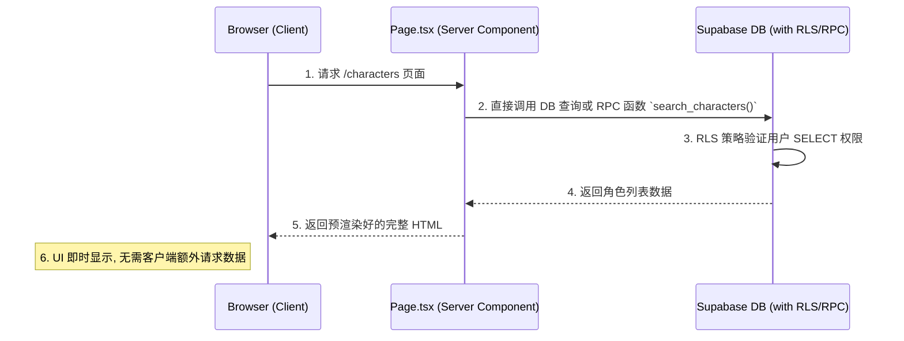
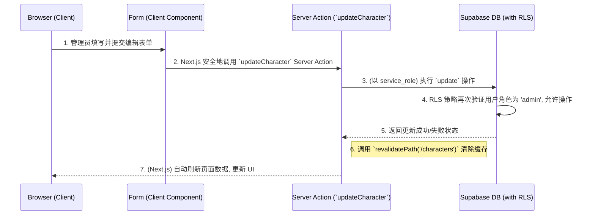
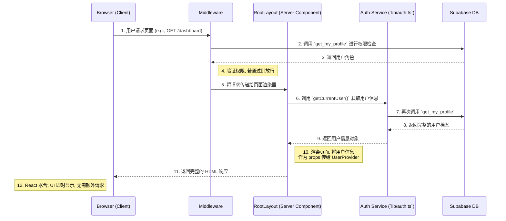

# 前端功能页面架构与交互

> **目标**: 为应用内的功能页面（如“角色管理”、“知识库管理”等）提供一个标准化的、可复用的架构模式，确保开发效率、性能和安全性。

## 1. 页面数据读取/写入流程模板

架构的核心是区分**数据读取 (Read)** 和**数据写入 (Write)** 两种场景，并采用不同的最优策略。

### 1.1. 数据读取流程 (Read Flow via Server Component)
此流程适用于列表页、详情页等只读场景，旨在实现最佳加载性能。

**核心思想**: 数据获取和页面渲染完全在服务端完成。

-   **实现**:
    1.  页面文件（如 `app/characters/page.tsx`）是一个**异步服务器组件 (`async function Page()`)**。
    2.  在该组件内部，直接 `await` 数据库客户端的查询请求。
    3.  查询结果直接作为 `props` 传递给渲染列表的客户端组件。

### 1.2. 数据写入流程 (Write Flow via Server Action)
此流程适用于创建、更新、删除等操作，旨在提供安全、流畅的交互体验，同时避免编写专门的 API 路由。

**核心思想**: 利用 Server Action 在服务端安全地执行变更，并通过 `revalidatePath` 自动更新UI。

-   **实现**:
    1.  定义一个 Server Action 函数（如 `updateCharacter`），通常放在独立的 `actions.ts` 文件中。
    2.  客户端组件（如表单）的 `onSubmit` 事件直接调用该 Action。
    3.  Action 内部执行数据库操作，并在成功后调用 `revalidatePath` 或 `revalidateTag` 来清除Next.js的数据缓存。
    4.  Next.js 会自动重新获取数据并更新受影响的UI部分。

---

## 2. 核心认证与数据流: `Middleware`→`Layout`→`UserProvider`

这是整个应用启动时，为客户端注入全局用户状态的核心链路。

### 2.1. 流程图

### 2.2. 组件职责

-   **`middleware.ts` (安全网关)**:
    -   负责所有受保护路由的**认证**和**鉴权**。
    -   检查会话，如未登录则重定向。
    -   调用数据库获取**角色**，判断页面访问权限。
    -   **不向请求中注入任何数据**，只负责放行或重定向。

-   **`layout.tsx` (数据获取桥梁)**:
    -   作为根服务器组件，在服务端**首次且唯一一次**调用 `getCurrentUser()` 来获取完整的用户信息。
    -   将获取到的用户信息 (`userProfile`) 作为 `initialProfile` prop 传递给客户端的 `<UserProvider>`。

-   **`user-context.tsx` (全局状态中心)**:
    -   是一个客户端组件 (`'use client'`)。
    -   接收来自 `layout.tsx` 的 `initialProfile` prop，并用它来初始化 `useState`。
    -   **不包含任何 `useEffect` 数据获取逻辑**，确保组件挂载时数据即已存在，避免UI闪烁。
    -   通过 React Context 向所有子组件提供全局的用户信息。

---

## 3. 权限化 UI

-   **核心职责**: 客户端组件的核心职责之一是根据从服务端接收的数据和用户的权限角色，动态地渲染 UI。
-   **实现方式**:
    1.  UI 组件通过 `useUser()` hook 从 `UserContext` 中获取当前用户的角色 (`userRole`)。
    2.  使用条件渲染（例如 `userRole === 'admin' && <Button>创建</Button>`）来决定是否显示敏感操作的 UI 元素（如“创建”、“编辑”、“删除”按钮）。
-   **安全提示**: 这是一种前端安全措施和良好的用户体验，但**真正的安全依赖于服务端 (Server Action) 和数据库 (RLS) 的强校验**。

---

## 4. 性能与一致性策略

-   **避免水合错误 (`use-mounted.ts`)**:
    -   提供一个 `useMounted` 钩子，它在组件于客户端成功挂载后返回 `true`。
    -   主要用于解决服务端渲染 (SSR) 和客户端渲染 (CSR) 之间可能出现的 UI 不一致问题。例如，确保只在客户端渲染某些依赖浏览器环境（如 `localStorage`）的 UI。

-   **智能缓存与自动刷新 (`revalidatePath`)**:
    -   Server Action 在完成数据写入后，通过调用 `revalidatePath` 来通知 Next.js 清除特定路径的数据缓存。
    -   这使得 Next.js 能够重新获取最新数据并将其发送到客户端，实现近乎实时的 UI 更新，而无需手动管理客户端状态。

-   **样式合并 (`utils.ts`)**:
    -   提供 `cn` 函数（结合 `clsx` 和 `tailwind-merge`），用于优雅地合并和覆盖 Tailwind CSS 类名，避免样式冲突，提升开发体验。
