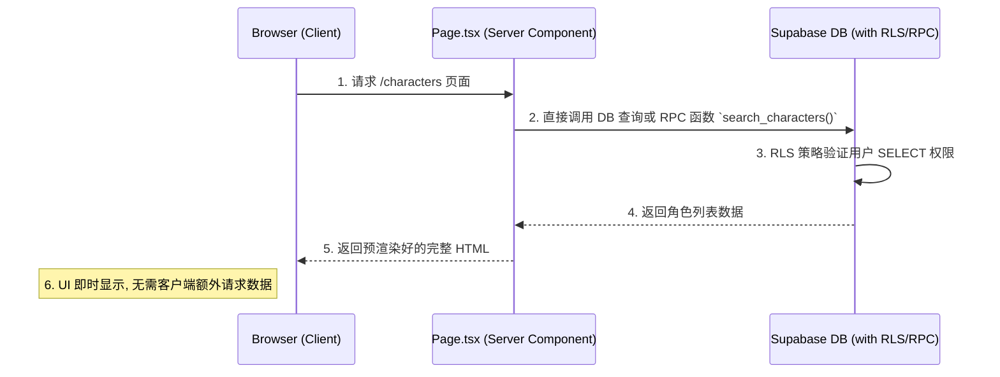
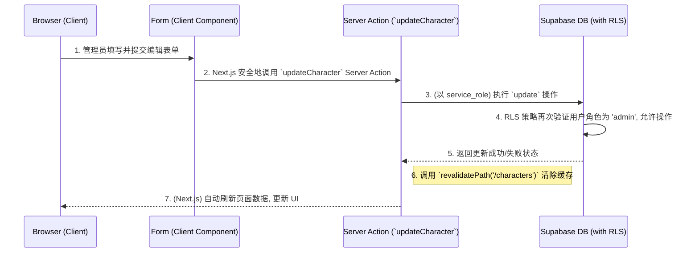

# 功能页面架构设计指南 v2 (WIP)

## 1. 核心原则

本设计旨在为应用内的功能页面（如“角色管理”、“知识库管理”等）提供一个标准化的、可复用的架构模式。所有设计都严格遵循以下核心原则：

-   **服务端渲染优先 (SSR First)**: 针对只读查询、列表页和检索场景，页面应采用 Next.js Server Components 直接从数据库或 RPC 函数获取数据。这能实现首屏内容的直接输出，减少客户端与服务器之间的网络往返，从而极大地提升加载速度和用户体验。

-   **分层安全网关 (Layered Security Gateway)**: 针对增、改、删等写入操作（通常仅限管理员），我们构建应用层和数据库层双重安全保障。
    -   **应用层**: 通过 Server Actions 或少量专设的 API Routes 执行操作，并可使用 `service_role` 以获得必要权限。
    -   **数据库层**: 利用行级别安全 (RLS) 策略作为最终防线，确保即使应用层逻辑有误，数据权限依然稳固。
    -   **重点设防**: 此安全网关策略将重点部署在“写入”和“向量检索”这两类关键路径上，而非全量覆盖所有数据访问。

-   **逻辑下沉与封装 (Logic Encapsulation)**: 复杂的查询逻辑，尤其是向量检索，应封装为只读的数据库函数 (RPC)。例如，`search_characters` 函数将作为统一的检索入口，供 Server Components 或 API Routes 调用。这不仅提升了执行效率，也简化了服务端代码，并为未来的性能优化（如添加索引、缓存）奠定了基础。

---

## 2. 整体架构流程图

### a. 数据读取 (Read Flow)

此流程适用于列表页、详情页等只读场景。

### b. 数据写入 (Write Flow via Server Action)

此流程适用于创建、更新、删除等仅限管理员的操作。

---

## 3. 分层设计详解

### 3.1. 数据库层 (Supabase): 安全与性能的基石

我们将复杂的业务逻辑和安全规则下沉到数据库中。

-   **权限管理: 行级别安全策略 (RLS)**
    RLS 是我们的核心安全屏障，作为写入操作的最后一道防线。它确保只有特定角色（如 `admin`）的用户才能修改数据，此规则由数据库强制执行，无法被任何应用层逻辑绕过。

-   **高性能查询: 数据库函数 (RPC)**
    为了高效地执行向量相似度等复杂查询，我们将其封装为数据库函数。这使得服务端可以像调用 API 一样调用一个高度优化的数据库内部流程，获取所需数据，同时简化了服务端代码。

### 3.2. 服务端层 (Next.js): 业务逻辑的编排

-   **数据获取: 服务器组件 (Server Components)**
    所有只读页面均由服务器组件负责。它们在服务端直接 `await` 数据库查询结果，将数据与组件渲染为最终的 HTML，然后一次性发送给浏览器。这是实现最佳加载性能的关键。

-   **数据变更: 服务器动作 (Server Actions)**
    对于创建和更新操作，我们优先使用 Server Actions，避免编写专门的 API 路由。这些 Action 在服务端安全执行，可以安全地使用 `service_role` 权限。数据库的 RLS 策略会进行二次验证，提供双重保障。操作成功后，通过调用 `revalidatePath` 来智能地更新客户端缓存，实现UI的自动刷新。

### 3.3. 客户端层 (React): 动态与安全的 UI

-   **权限化 UI**
    客户端组件的核心职责是根据从服务端接收的数据和用户的权限角色，动态地渲染 UI。例如，“创建”或“编辑”按钮只会在用户是管理员时才会被渲染到 DOM 中。这既是良好的用户体验，也是一道前端安全防线，但真正的安全依赖于服务端和数据库的强校验。
