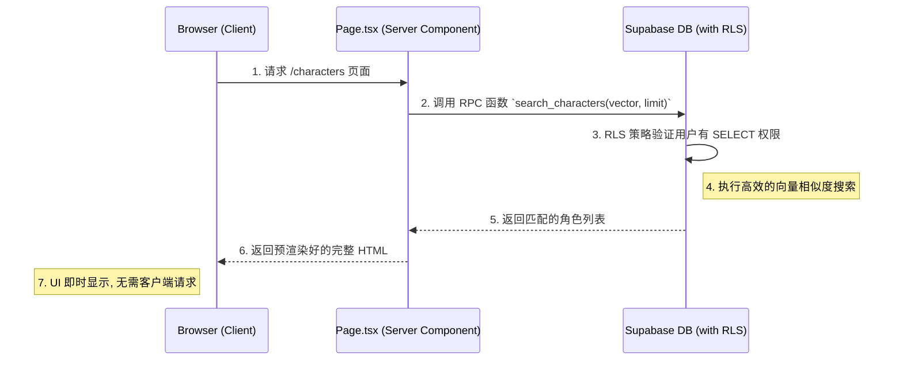
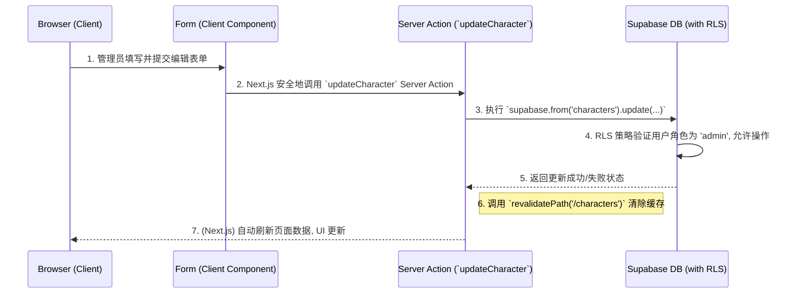

# 功能页面架构设计指南 (以 Characters 页面为例)

## 1. 核心原则

本设计旨在为应用内的功能页面（如“角色管理”、“知识库管理”等）提供一个标准化的、可复用的架构模式。所有设计都严格遵循两大核心原则：

-   **高效 (Efficiency)**: 最大化服务端能力，最小化客户端负载，实现极速的页面加载和响应。
-   **安全 (Security)**: 将安全规则下沉至数据库层，由数据库强制执行，确保数据访问的绝对安全。

---

## 2. 整体架构流程图

### a. 数据读取 (Read Flow)



### b. 数据写入 (Write Flow via Server Action)



---

## 3. 分层设计详解

### 3.1. 数据库层 (Supabase): 安全与性能的基石

我们将复杂的业务逻辑和安全规则全部下沉到数据库中。

#### a. 权限管理: 行级别安全策略 (RLS)

RLS 是我们的核心安全屏障。对于 `characters` 表，我们将启用 RLS 并设置以下策略：

-   **读取 (`SELECT`) 策略**:
    ```sql
    CREATE POLICY "Allow all authenticated users to read characters"
    ON public.characters FOR SELECT
    TO authenticated
    USING (true);
    ```
    *   **说明**: 允许任何已经登录的用户 (`authenticated`) 读取 `characters` 表中的所有数据。

-   **写入与修改 (`INSERT`, `UPDATE`) 策略**:
    ```sql
    CREATE POLICY "Allow only admins to insert or update characters"
    ON public.characters FOR (INSERT, UPDATE)
    TO authenticated
    USING (get_my_role() IN ('admin', 'super_admin'))
    WITH CHECK (get_my_role() IN ('admin', 'super_admin'));
    ```
    *   **说明**: **只允许**当前用户的角色为 `admin` 或 `super_admin` 时，才能进行 `INSERT` 或 `UPDATE` 操作。`get_my_role()` 是我们在 `07_auth_rls.sql` 中定义的辅助函数。

**核心优势**: 安全规则由数据库强制执行，无法被任何客户端或应用层逻辑绕过。

#### b. 高性能查询: 数据库函数 (RPC)

为了高效地执行向量相似度搜索，我们创建一个数据库函数。

-   **创建 `search_characters` 函数**:
    ```sql
    CREATE OR REPLACE FUNCTION public.search_characters(
        query_vector vector(1536), -- 匹配模型的维度
        match_count integer
    )
    RETURNS SETOF characters
    LANGUAGE sql STABLE
    AS $$
      SELECT *
      FROM public.characters
      ORDER BY embedding <=> query_vector
      LIMIT match_count;
    $$;
    ```
    *   **说明**: 此函数接收一个查询向量和需要返回的记录数，利用 `pgvector` 的 `<=>` (余弦距离) 操作符进行排序，并返回最匹配的前 `n` 条记录。数据库处理这种计算密集型任务远比应用服务器高效。

### 3.2. 服务端层 (Next.js): 业务逻辑的编排

#### a. 数据获取: 服务器组件 (Server Components)

`characters` 页面的主文件 (`src/app/characters/page.tsx`) 将是一个服务器组件。

-   **职责**:
    1.  **直接获取数据**: 在组件内部，直接 `await` 调用 Supabase RPC 函数：
        ```tsx
        // src/app/characters/page.tsx
        import { createServerActionClient } from '@/lib/supabase-server';
        
        export default async function CharactersPage() {
          const supabase = await createServerActionClient();
          const { data: characters, error } = await supabase.rpc('search_characters', {
            query_vector: someVector, //  通常来自用户的输入，也需在服务端生成
            match_count: 10
          });
        
          // ... 将 characters 传递给客户端组件进行渲染
          return <CharacterList initialData={characters} />;
        }
        ```
    2.  **服务端渲染**: 所有数据获取在服务器上完成，浏览器直接接收最终的 HTML，实现最佳的加载性能。

#### b. 数据变更: 服务器动作 (Server Actions)

对于创建和更新操作，我们将使用 Server Actions，以避免编写专门的 API 路由。

-   **职责**:
    1.  **定义 Action**: 在一个文件中（例如 `src/app/characters/actions.ts`）定义 `createCharacter` 和 `updateCharacter` 函数。
        ```ts
        'use server';
        import { createServerActionClient } from '@/lib/supabase-server';
        import { revalidatePath } from 'next/cache';
        
        export async function updateCharacter(formData: FormData) {
          const supabase = await createServerActionClient();
          const id = formData.get('id');
          // ... 从 formData 获取其他字段
        
          const { error } = await supabase
            .from('characters')
            .update({ name: formData.get('name') })
            .eq('id', id);
        
          if (!error) {
            revalidatePath('/characters'); // 关键：使数据缓存失效，触发页面刷新
          }
        }
        ```
    2.  **安全执行**: 当客户端表单调用此 Action 时，它会在服务器上安全执行。数据库的 RLS 策略会自动验证执行此操作的用户是否具有管理员权限。

### 3.3. 客户端层 (React): 动态与安全的 UI

#### a. 权限化 UI

客户端组件负责根据用户权限动态展示 UI。

-   **职责**:
    1.  **获取角色**: 在客户端组件（如 `CharacterList.tsx` 或 `CharacterForm.tsx`）中，使用 `useUser()` hook 获取当前用户的角色。
    2.  **条件渲染**:
        ```tsx
        'use client';
        import { useUser } from '@/components/user-context';
        
        export function CharacterToolbar() {
          const { userRole } = useUser();
          const isAdmin = userRole === 'admin' || userRole === 'super_admin';
        
          return (
            <div>
              {isAdmin && <button>创建新角色</button>}
            </div>
          );
        }
        ```
    *   **说明**: “创建”或“编辑”按钮只会在用户是管理员时才会被渲染到 DOM 中。这既是良好的用户体验，也是一道前端安全防线。

通过这套架构，我们确保了功能页面在高效和安全的前提下，具备了良好的可维护性和扩展性。
