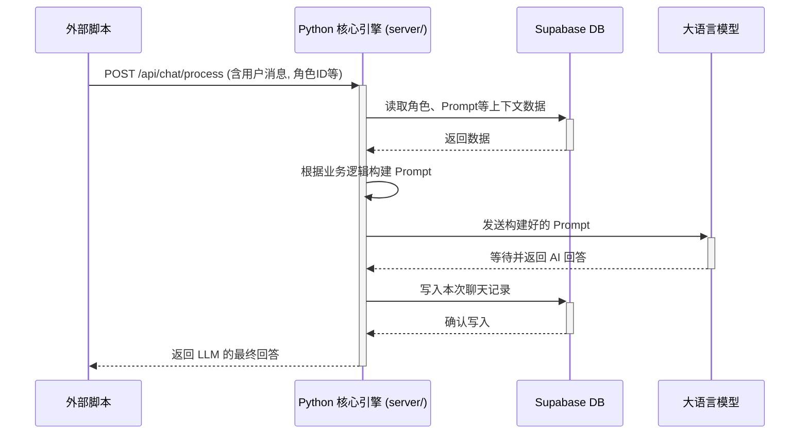
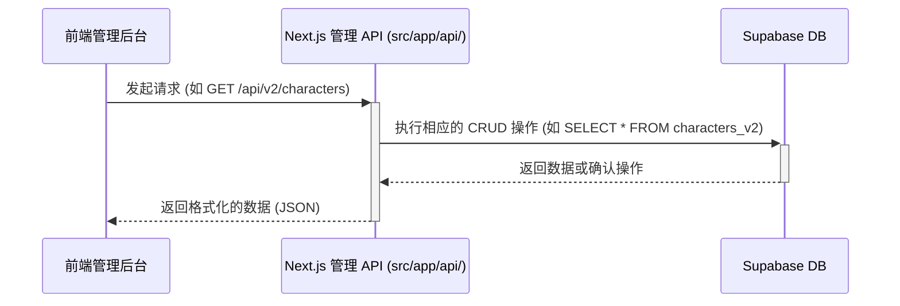

# 系统架构设计：双核模式

> **目标**: 设计一个健壮、可扩展且职责清晰的后端架构，以支持“机器人即服务”的核心业务场景。该架构需要同时服务于需要即时响应的外部脚本和需要流畅体验的内部管理后台。

---

## 1. 核心设计理念：职责分离

本架构采用“双核”模式，将后端服务明确划分为两个完全独立、解耦的应用：

1.  **核心聊天引擎 (Core Chat Engine)**: 使用 **Python** 构建，专职处理计算密集型和 AI 相关的核心聊天逻辑。
2.  **管理面板 API (Management Panel API)**: 使用 **Next.js API Routes** 构建，专职为前端管理后台提供快速、轻量的 CRUD (增删改查) 服务。

这两个核心服务之间**不存在任何直接的网络调用**。它们唯一的交集是共享的 **Supabase 数据库**，后者作为系统的“数据中枢”和唯一真相来源。

---

## 2. 高阶数据流

```text
+------------------+      (1. 发送消息)       +---------------------------------+
|   外部脚本        | ----------------------> | Python 核心引擎 (server/)       |
| (多个, 24/7运行) |      POST /api/chat/process     |   - 验证请求                  |
+------------------+      (同步请求)        |   - 从 Supabase 拉取所有数据    |
        ^                                   |   - 构建 Prompt               |
        |                                   |   - 调用 LLM                  |
        |          (4. 返回LLM回答)         |   - 等待 LLM 返回             |
        +----------------------------------- |   - 保存聊天记录到 Supabase   |
                                            +---------------------------------+


+------------------+      (2. 管理数据)       +---------------------------------+
|   前端管理后台     | ----------------------> | Next.js 管理 API (src/app/api/) |
| (React App)      |      GET/POST/PUT/DELETE      |   - 验证用户权限                |
+------------------+      (快速响应)        |   - 对 Supabase 进行 CRUD 操作  |
                                            +---------------------------------+


                 (3. 读/写数据)
                        |
                        V
+-------------------------------------------------------------------------------+
|                                Supabase 数据库                                  |
| (角色人设, 知识库, Prompts, 聊天记录, 用户信息 ...)                             |
+-------------------------------------------------------------------------------+
```

---

## 3. 组件详解

### 3.1. Python 核心聊天引擎

-   **位置**: `server/`
-   **技术栈**: Python (FastAPI)
-   **核心职责**:
    -   **同步处理聊天**: 为外部脚本提供一个唯一的、同步的 API 端点 (`POST /api/chat/process`)。
    -   **完整业务逻辑**: 执行从接收请求到返回 LLM 结果的完整流程，包括：
        1.  从 Supabase 获取上下文数据 (角色人设、Prompt、历史记录等)。
        2.  根据复杂的业务逻辑构建最终的 Prompt。
        3.  调用并等待 LLM 服务返回结果。
        4.  将交互记录存入数据库。
        5.  将最终的 AI 回答**直接返回**给调用方。
-   **设计原则**: 逻辑内聚、高可靠性。所有与实时聊天相关的复杂计算都封装于此。

### 3.2. Next.js 管理面板 API

-   **位置**: `src/app/api/`
-   **技术栈**: TypeScript (Next.js API Routes)
-   **核心职责**:
    -   **支撑管理后台**: 为前端管理应用提供数据接口。
    -   **快速数据操作**: 负责所有非实时的管理类 CRUD 操作，例如：
        -   创建/编辑/删除角色人设。
        -   管理知识库条目。
        -   配置系统提示词 (Prompts)。
-   **设计原则**: 轻量、快速、无状态。仅作为数据库的代理层，为管理人员提供流畅的后台操作体验。

---

## 4. 交互流程

### 4.1. 外部脚本实时聊天流程 (同步)

此流程是系统的核心价值所在，专为需要即时反馈的外部自动化脚本设计。



### 4.2. 管理后台数据操作流程 (异步于聊天流)

此流程确保了后台管理人员可以高效、流畅地配置和维护系统数据，而不会被实时聊天任务阻塞。



---

## 5. 总结

该双核架构的优势：

-   **完全解耦**: Python 核心和 Next.js API 互不依赖，仅通过数据库通信，易于独立开发、部署和扩展。
-   **性能最优化**: 每个组件都采用了最适合其任务的技术栈，确保了外部脚本的响应稳定性和后台管理的流畅性。
-   **职责清晰**: 避免了单个服务变得过于臃肿和复杂，提高了系统的长期可维护性。
-   **满足业务需求**: 完美支持了“需要同步获取 AI 回复”的核心业务场景。
