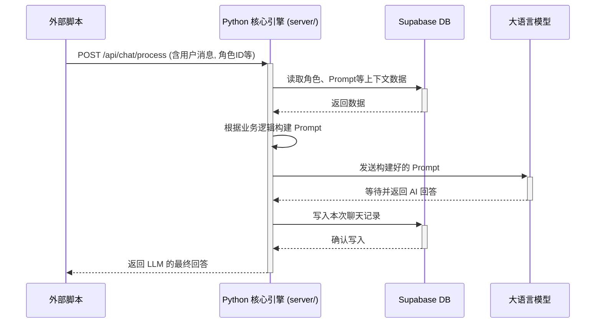
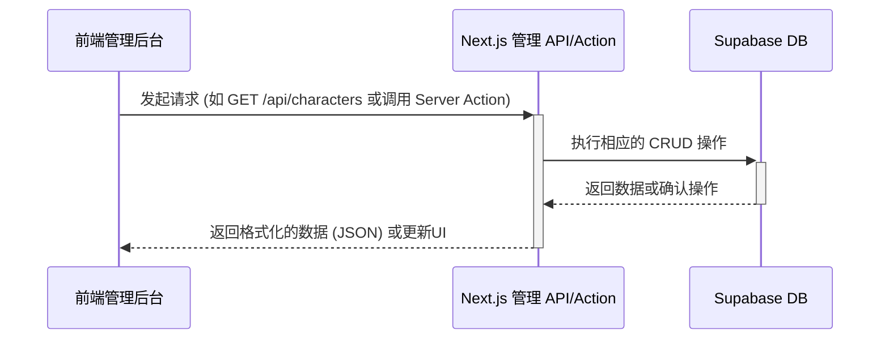

# 系统架构总览

> **目标**: 本文档定义了系统的宏观架构。它采用“双核”模式，旨在将需要即时响应的 AI 聊天服务与需要流畅体验的后台管理服务进行物理隔离和解耦，确保各自的性能与可维护性。

## 1. 架构原则

-   **职责分离 (Separation of Concerns)**: 系统被明确划分为两个独立的应用：一个处理计算密集型 AI 逻辑的 **Python 核心聊天引擎**，和一个为前端提供轻量级 CRUD 服务的 **Next.js 管理面板 API**。这两个服务完全解耦，唯一的交集是共享的 **Supabase 数据库**。

-   **服务端渲染优先 (SSR First)**: 针对管理后台的只读查询、列表页和检索场景，页面优先采用 Next.js Server Components 直接从数据库获取数据，实现首屏内容的直接输出，优化加载速度。

-   **分层安全网关 (Layered Security Gateway)**: 针对增、改、删等写入操作，构建**应用层** (Server Actions / API Routes) 和**数据库层** (RLS) 的双重安全保障，确保数据操作的权限和安全。

-   **逻辑下沉与封装 (Logic Encapsulation)**: 复杂的查询逻辑（尤其是向量检索）被封装为数据库函数 (RPC)，简化了服务端代码，提升了执行效率，并便于未来进行统一优化。

---

## 2. 组件与系统边界

+------------------+      (1. 发送消息)       +---------------------------------+
|   外部脚本        | ----------------------> | Python 核心引擎 (server/)       |
| (多个, 24/7运行) |      POST /api/chat/process     |   - 验证请求                  |
+------------------+      (同步请求)        |   - 从 Supabase 拉取所有数据    |
        ^                                   |   - 构建 Prompt               |
        |                                   |   - 调用 LLM                  |
        |          (4. 返回LLM回答)         |   - 等待 LLM 返回             |
        +----------------------------------- |   - 保存聊天记录到 Supabase   |
                                            +---------------------------------+

+------------------+      (2. 管理数据)       +---------------------------------+
|   前端管理后台     | ----------------------> | Next.js 管理 API (src/app/api/) |
| (React App)      |      GET/POST/PUT/DELETE      |   - 验证用户权限                |
+------------------+      (快速响应)        |   - 对 Supabase 进行 CRUD 操作  |
                                            +---------------------------------+

                 (3. 读/写数据)
                        |
                        V
+-------------------------------------------------------------------------------+
|                                Supabase 数据库                                  |
| (角色人设, 知识库, Prompts, 聊天记录, 用户信息 ...)                             |
+-------------------------------------------------------------------------------+

### 2.1. Python 核心聊天引擎 (`server/`)
-   **技术栈**: Python (FastAPI)
-   **核心职责**:
    -   **同步处理聊天**: 为外部脚本提供唯一的、同步的 API 端点 (`POST /api/chat/process`)。
    -   **完整业务逻辑**: 执行从接收请求到返回 LLM 结果的完整流程，包括数据拉取、Prompt 构建、LLM 调用和聊天记录存储。
-   **设计原则**: 逻辑内聚、高可靠性。所有与实时聊天相关的复杂计算都封装于此。

### 2.2. Next.js 管理面板 (`src/`)
-   **技术栈**: TypeScript, Next.js (App Router), React
-   **核心职责**:
    -   **支撑管理后台**: 为前端管理应用提供数据接口 (API Routes / Server Actions) 和 UI 渲染 (Server / Client Components)。
    -   **快速数据操作**: 负责所有非实时的管理类 CRUD 操作，如角色人设、知识库、系统提示词的管理。
-   **设计原则**: 轻量、快速、无状态。作为数据库的代理层，为管理人员提供流畅的后台操作体验。

### 2.3. Supabase 数据库
-   **定位**: 系统的“数据中枢”和唯一真相来源。
-   **核心职责**:
    -   **数据持久化**: 存储所有业务数据，包括角色人设、知识库、Prompts、聊天记录、用户信息等。
    -   **权限控制**: 通过行级安全 (RLS) 策略实现数据库层的安全保障。
    -   **业务逻辑**: 通过数据库函数 (RPC) 和触发器，封装和自动化部分业务逻辑（如向量检索、数据软删除同步）。

---

## 3. 系统时序图

系统存在两条主要的工作流：外部脚本的实时聊天流和管理员的后台数据操作流。其中，**实时聊天流程是系统的核心价值所在**。

### 3.1. 主流程：外部脚本实时聊天 (同步)

### 3.2. 辅助流程：管理后台数据操作 (异步于聊天流)

---

## 4. 数据流与失败域

-   **数据中枢**: 所有数据均通过 Supabase 进行持久化和交换。两大核心服务（Python 引擎和 Next.js API）**永不直接通信**，完全通过数据库解耦。
-   **失败域隔离**:
    -   **Next.js 管理面板的故障**: 如果管理面板或其 API 宕机，只会影响管理员的后台操作，**不会影响**核心的实时聊天服务。外部脚本的调用将继续正常工作。
    -   **Python 核心引擎的故障**: 如果聊天引擎宕机，外部脚本的实时聊天功能将中断。然而，管理员依然可以通过管理后台对系统数据进行维护和配置。
    -   **Supabase 故障**: 这是**全局单点故障**。如果数据库无法访问，两大核心服务将同时失效。

---

## 5. 横切关注点

`(TODO)`: 此部分定义了贯穿整个系统的通用策略，需要进一步设计和明确。
-   **可观测性 (Observability)**:
    -   **日志**: 如何在 Vercel Serverless 环境和 Python 服务中实现结构化日志记录？日志聚合方案是什么？
    -   **监控**: 需要监控哪些关键指标（如 API 延迟、错误率、数据库连接数）？
    -   **追踪**: 是否需要引入分布式追踪来分析跨服务请求的瓶颈？
-   **可伸缩性 (Scalability)**:
    -   Next.js API 和 Edge Functions 具有良好的无服务器伸缩性。
    -   Python 核心引擎的部署模式是什么（例如，容器化部署在 Cloud Run）？其自动扩缩容策略如何配置？
    -   Supabase 数据库的性能瓶颈和扩容计划是什么？
-   **容错 (Fault Tolerance)**:
    -   **重试机制**: 外部脚本调用 Python 引擎失败时，应采取何种重试策略？
    -   **降级服务**: 在 LLM 服务不可用或响应缓慢时，是否有降级策略（如返回预设回答、缩短超时时间）？
    -   **数据库连接**: 如何处理数据库连接池耗尽或连接失败的情况？
